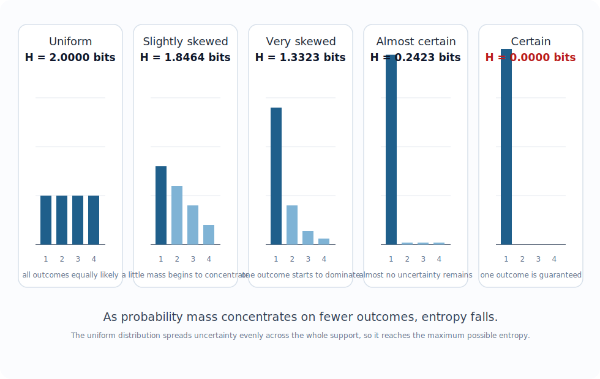

# Chapter 2: Entropy — Measuring the Unknowable

## What We Left Unfinished

At the end of Chapter 1, we arrived at Shannon entropy — the average surprise of a source — and wrote a function to compute it. We saw that a fair coin has entropy 1 bit, a fair die has entropy 2.585 bits, and a certain outcome has entropy 0.

But we moved on too quickly. Entropy is the central concept of this entire book. It deserves more than an introduction. In this chapter we will take it apart, examine it from every angle, and build the kind of deep intuition that lets you *think* in entropy rather than just compute it.

By the end of this chapter you will be able to look at a dataset, a distribution, or a system and have genuine intuitions about its entropy: whether it is high or low, what is driving it, and what it implies about compression, communication, and uncertainty.

Let's start by asking a question that sounds philosophical but turns out to be deeply practical: what exactly is entropy measuring?

---

## Entropy as Average Surprise

Recall our formula from Chapter 1. For a random variable *X* that takes values *x₁, x₂, ..., xₙ* with probabilities *p₁, p₂, ..., pₙ*, the Shannon entropy is:

```
H(X) = -∑ p(x) · log₂(p(x))
```

We described this as the *expected surprise* — the probability-weighted average of the information content of each outcome. Let's make this completely concrete.

Suppose you work on a system that processes customer orders. Each order has a status, and from your logs you have worked out the following distribution:

| Status | Probability |
|---|---|
| `completed` | 0.70 |
| `pending` | 0.20 |
| `failed` | 0.08 |
| `refunded` | 0.02 |

How much information does each status carry when you observe it?

```python
import math

statuses = {
    'completed': 0.70,
    'pending':   0.20,
    'failed':    0.08,
    'refunded':  0.02,
}

print(f"{'Status':<12} {'Probability':>12} {'Surprise (bits)':>16}")
print("-" * 42)
for status, p in statuses.items():
    surprise = -math.log2(p)
    print(f"{status:<12} {p:>12.2f} {surprise:>16.3f}")

# Now compute entropy
probs = list(statuses.values())
H = -sum(p * math.log2(p) for p in probs)
print(f"\nEntropy of order status: {H:.3f} bits")
```

Output:
```
Status       Probability  Surprise (bits)
------------------------------------------
completed           0.70            0.515
pending             0.20            2.322
failed              0.08            3.644
refunded            0.02            5.644

Entropy of order status: 1.189 bits
```

Study this table. A `completed` order tells you almost nothing — you were already 70% confident it would be completed. A `refunded` order is genuinely surprising, carrying over 5.6 bits of information. But when we ask how surprised we are *on average*, we have to weight each surprise by how often it occurs. `refunded` is surprising but rare; `completed` is unsurprising but common. The weighted average comes out to 1.189 bits.

This is entropy: not the maximum surprise, not the minimum, but the *expected* surprise you will encounter if you watch this system operate over time.

---

## The Shape of Entropy

Entropy is not just a single number — it is a function of a distribution. Let's visualize how it behaves as we vary a simple distribution.

Consider a biased coin with probability *p* of heads. As *p* varies from 0 to 1, how does the entropy change?

```python
import math

def binary_entropy(p):
    """Entropy of a two-outcome distribution with probabilities p and 1-p."""
    if p == 0 or p == 1:
        return 0.0
    return -(p * math.log2(p) + (1 - p) * math.log2(1 - p))

# Print a table of entropy values
print(f"{'p':>6}  {'H(p)':>8}")
print("-" * 18)
for i in range(0, 11):
    p = i / 10
    print(f"{p:>6.1f}  {binary_entropy(p):>8.4f}")
```

Output:
```
     p      H(p)
------------------
   0.0    0.0000
   0.1    0.4690
   0.2    0.7219
   0.3    0.8813
   0.4    0.9710
   0.5    1.0000
   0.6    0.9710
   0.7    0.8813
   0.8    0.7219
   0.9    0.4690
   1.0    0.0000
```

{fig-align="center" width="92%"}

This curve — the binary entropy function — has a beautiful shape. It is symmetric around *p* = 0.5, where it peaks at exactly 1 bit. It falls to zero at both extremes, where the outcome is certain. The curve is concave: entropy always increases as you move the distribution toward uniformity, and always decreases as you push it toward certainty.

This shape encodes several fundamental truths:

**Certainty kills entropy.** The moment one outcome becomes inevitable, entropy collapses to zero. This is true for any distribution, not just binary ones. A system where you always know the answer has nothing to tell you.

**Uniformity maximizes entropy.** The most uncertain you can be about a distribution over *n* outcomes is when all outcomes are equally likely. This is the maximum entropy distribution, and it has entropy log₂(n) bits.

**Entropy is concave.** Mix two distributions together and the result has at least as much entropy as the weighted average of the originals. This is Jensen's inequality applied to the logarithm, and it has practical implications: pooling uncertain systems together does not reduce overall uncertainty.

---

## Maximum Entropy: The Uniform Distribution

Let's build intuition for the fact that the uniform distribution maximizes entropy for a fixed number of outcomes.

```python
from itertools import product

def entropy(probs):
    H = -sum(p * math.log2(p) for p in probs if p > 0)
    return max(0.0, H)

def max_possible_entropy(n):
    """Entropy of a uniform distribution over n outcomes."""
    return math.log2(n)

# Compare various distributions over 4 outcomes
distributions = {
    "Uniform":       [0.25, 0.25, 0.25, 0.25],
    "Slightly skewed": [0.40, 0.30, 0.20, 0.10],
    "Very skewed":   [0.70, 0.20, 0.07, 0.03],
    "Almost certain":[0.97, 0.01, 0.01, 0.01],
    "Certain":       [1.00, 0.00, 0.00, 0.00],
}

print(f"{'Distribution':<20} {'Entropy':>10} {'% of max':>10}")
print("-" * 42)
max_H = max_possible_entropy(4)
for name, dist in distributions.items():
    H = entropy(dist)
    print(f"{name:<20} {H:>10.4f} {100*H/max_H:>9.1f}%")

print(f"\nMaximum possible (log₂4): {max_H:.4f} bits")
```

Output:
```
Distribution         Entropy   % of max
------------------------------------------
Uniform               2.0000     100.0%
Slightly skewed       1.8464      92.3%
Very skewed           1.2449      62.2%
Almost certain        0.2419      12.1%
Certain               0.0000       0.0%

Maximum possible (log₂4): 2.0000 bits
```

{fig-align="center" width="96%"}

The uniform distribution achieves 100% of the theoretical maximum. Any deviation from uniformity — any concentration of probability mass onto certain outcomes — reduces entropy. This is not a coincidence or a special property of this example. It is a theorem, and it holds for any finite distribution.

This has an important practical implication: **if you want to maximize the information you can transmit per symbol, use a uniform distribution over your symbol set.** This is why good compression algorithms produce output that looks uniformly random — they have redistributed the probability mass as uniformly as possible over the output symbols.

---

## Entropy and Compression: The Fundamental Connection

We keep gesturing toward compression as an application of entropy. Let us make the connection precise.

Suppose you want to encode a sequence of symbols from an alphabet — say, the order statuses from earlier. You want to represent each symbol as a binary string. What is the shortest average codeword length you can achieve?

Shannon's source coding theorem answers this exactly: **the minimum average codeword length is the entropy of the source**, measured in bits.

This is a remarkable statement. It says that entropy is not just a mathematical abstraction — it is the fundamental limit on how efficiently you can represent information. No code, however clever, can do better than the entropy. And there exist codes (Huffman codes, arithmetic codes) that approach this limit arbitrarily closely.

Let's see this in action with our order statuses:

```python
import heapq
from collections import defaultdict

def huffman_codes(frequencies):
    """Build a Huffman code for the given symbol frequencies."""
    # Build priority queue
    heap = [[weight, [symbol, ""]] for symbol, weight in frequencies.items()]
    heapq.heapify(heap)
    
    while len(heap) > 1:
        lo = heapq.heappop(heap)
        hi = heapq.heappop(heap)
        for pair in lo[1:]:
            pair[1] = '0' + pair[1]
        for pair in hi[1:]:
            pair[1] = '1' + pair[1]
        heapq.heappush(heap, [lo[0] + hi[0]] + lo[1:] + hi[1:])
    
    return {symbol: code for symbol, code in heap[0][1:]}

statuses = {
    'completed': 0.70,
    'pending':   0.20,
    'failed':    0.08,
    'refunded':  0.02,
}

codes = huffman_codes(statuses)

print(f"{'Status':<12} {'Prob':>6} {'Code':>10} {'Length':>8} {'p × length':>12}")
print("-" * 54)
avg_length = 0
for symbol, code in sorted(codes.items(), key=lambda x: -statuses[x[0]]):
    p = statuses[symbol]
    l = len(code)
    avg_length += p * l
    print(f"{symbol:<12} {p:>6.2f} {code:>10} {l:>8} {p*l:>12.4f}")

H = -sum(p * math.log2(p) for p in statuses.values())
print(f"\nAverage codeword length: {avg_length:.4f} bits")
print(f"Entropy of source:       {H:.4f} bits")
print(f"Overhead:                {avg_length - H:.4f} bits ({100*(avg_length-H)/H:.1f}%)")
```

Output (one valid code assignment):
```
Status       Prob       Code   Length   p × length
------------------------------------------------------
completed    0.70          1        1       0.7000
pending      0.20         01        2       0.4000
failed       0.08        001        3       0.2400
refunded     0.02        000        3       0.0600

Average codeword length: 1.4000 bits
Entropy of source:       1.2290 bits
Overhead:                0.1710 bits (13.9%)
```

The Huffman code achieves 1.4 bits per symbol. The entropy of the source is 1.229 bits. The gap — 0.171 bits, or about 14% overhead — is the inefficiency of using discrete codewords. (Arithmetic coding, which we cover in Chapter 6, can close this gap almost entirely.) The exact bit patterns in a Huffman code are not unique: different implementations may swap 0 and 1 or break ties differently, while preserving the same code lengths and average cost.

Notice what the Huffman code did: it assigned a *one-bit* codeword to the *most common* symbol (`completed`, 70%), and *three-bit* codewords to the rarest symbols. This is exactly the right strategy — it minimizes the expected codeword length by aligning code length with information content.

The key insight: **optimal code lengths are equal to the information content of each symbol.** The optimal codeword for `completed` would be -log₂(0.70) ≈ 0.515 bits. Since we cannot use fractional bits in a simple prefix code, we round up to 1. The overhead comes from this rounding. Arithmetic coding sidesteps this by encoding many symbols at once, amortizing the rounding error.

---

## Joint Entropy and Conditional Entropy

So far we have dealt with single random variables. But real systems involve multiple variables that interact. What is the entropy of a pair of variables? And how does knowing one affect the uncertainty in the other?

### Joint Entropy

The joint entropy of two variables *X* and *Y* is simply the entropy of their joint distribution — the distribution over all pairs *(x, y)*:

```
H(X, Y) = -∑∑ p(x, y) · log₂(p(x, y))
```

```python
def joint_entropy(joint_probs):
    """
    joint_probs: a dict mapping (x, y) tuples to probabilities.
    """
    return -sum(p * math.log2(p) for p in joint_probs.values() if p > 0)
```

If *X* and *Y* are independent, the joint entropy is just the sum of the individual entropies:

```
H(X, Y) = H(X) + H(Y)    [if X and Y are independent]
```

This is the additivity property of entropy we saw in Chapter 1. Two independent coin flips have joint entropy 2 bits. Two independent dice have joint entropy 5.17 bits.

But when *X* and *Y* are dependent — when knowing one tells you something about the other — the joint entropy is *less* than the sum of the individual entropies. Dependence means shared information, which means you need fewer bits to describe both than you would need to describe each separately.

### Conditional Entropy

The conditional entropy H(Y|X) asks: how much uncertainty remains in *Y* once we know *X*?

```
H(Y|X) = -∑∑ p(x, y) · log₂(p(y|x))
```

Or equivalently:

```
H(Y|X) = H(X, Y) - H(X)
```

This is the chain rule of entropy. The total uncertainty of *(X, Y)* equals the uncertainty of *X* alone plus the residual uncertainty of *Y* once *X* is known.

Let's make this concrete. Suppose we extend our order status example. Orders come from two regions: domestic and international. Here is the joint distribution:

```python
# Joint distribution: p(region, status)
joint = {
    ('domestic',      'completed'): 0.42,
    ('domestic',      'pending'):   0.10,
    ('domestic',      'failed'):    0.03,
    ('domestic',      'refunded'):  0.01,
    ('international', 'completed'): 0.28,
    ('international', 'pending'):   0.10,
    ('international', 'failed'):    0.05,
    ('international', 'refunded'):  0.01,
}

# Marginal distributions
p_domestic      = sum(p for (r, s), p in joint.items() if r == 'domestic')
p_international = sum(p for (r, s), p in joint.items() if r == 'international')

# Conditional distributions p(status | region)
def conditional_dist(joint, given_value, given_index=0):
    filtered = {k: v for k, v in joint.items() if k[given_index] == given_value}
    total    = sum(filtered.values())
    return {k[1 - given_index]: v / total for k, v in filtered.items()}

dist_given_domestic      = conditional_dist(joint, 'domestic')
dist_given_international = conditional_dist(joint, 'international')

H_status_given_domestic      = entropy(list(dist_given_domestic.values()))
H_status_given_international = entropy(list(dist_given_international.values()))

# Conditional entropy H(status | region)
H_status_given_region = (
    p_domestic      * H_status_given_domestic +
    p_international * H_status_given_international
)

# Compare with unconditional entropy
H_status = entropy(list(statuses.values()))

print(f"H(status):               {H_status:.4f} bits")
print(f"H(status | domestic):    {H_status_given_domestic:.4f} bits")
print(f"H(status | intl):        {H_status_given_international:.4f} bits")
print(f"H(status | region):      {H_status_given_region:.4f} bits")
print(f"Information gain:        {H_status - H_status_given_region:.4f} bits")
```

Output:
```
H(status):               1.2290 bits
H(status | domestic):    1.0850 bits
H(status | intl):        1.3814 bits
H(status | region):      1.2154 bits
Information gain:        0.0135 bits
```

Knowing the region reduces our uncertainty about status — but only slightly, by 0.0135 bits. This still tells us that region is a weak predictor of order status in this dataset: the conditional entropy is only a little lower than the unconditional entropy. In Chapter 12, when we look at mutual information, we will turn this intuition into a principled feature selection technique.

One property of conditional entropy is worth stating explicitly, because it is easy to get backwards:

**Conditioning never increases entropy:**
```
H(Y|X) ≤ H(Y)
```

Knowing something can only reduce (or leave unchanged) your uncertainty. It can never make things more uncertain. This seems obvious, but it has non-obvious consequences in machine learning and statistics.

---

## Cross-Entropy: The Cost of Being Wrong

We have been computing entropy under the assumption that we know the true distribution. But in practice, we often operate under a *model* of the distribution that differs from reality.

Suppose the true distribution over order statuses is *p*, but your logging system was designed assuming distribution *q* (perhaps based on older data). The cross-entropy measures how many bits you need per symbol if you encode using *q* when the truth is *p*:

```
H(p, q) = -∑ p(x) · log₂(q(x))
```

```python
def cross_entropy(p, q):
    """
    Cross-entropy of true distribution p with respect to model q.
    p and q are dicts mapping symbols to probabilities.
    """
    return -sum(p[x] * math.log2(q[x]) for x in p if p[x] > 0)

# True distribution (current data)
p_true = {'completed': 0.70, 'pending': 0.20, 'failed': 0.08, 'refunded': 0.02}

# Stale model (old data, before a system reliability improvement)
q_stale = {'completed': 0.55, 'pending': 0.25, 'failed': 0.15, 'refunded': 0.05}

# Perfect model
q_perfect = p_true

H_true       = entropy(list(p_true.values()))
H_cross_good = cross_entropy(p_true, q_perfect)
H_cross_bad  = cross_entropy(p_true, q_stale)

print(f"True entropy H(p):           {H_true:.4f} bits")
print(f"Cross-entropy H(p, p):       {H_cross_good:.4f} bits  (perfect model)")
print(f"Cross-entropy H(p, q_stale): {H_cross_bad:.4f} bits  (stale model)")
print(f"Overhead from stale model:   {H_cross_bad - H_true:.4f} bits per symbol")
```

Output:
```
True entropy H(p):           1.2290 bits
Cross-entropy H(p, p):       1.2290 bits  (perfect model)
Cross-entropy H(p, q_stale): 1.3091 bits  (stale model)
Overhead from stale model:   0.0802 bits per symbol
```

When your model matches reality, cross-entropy equals true entropy — you achieve optimal encoding. When your model is wrong, you pay a penalty: 0.080 bits per symbol in this case. That may sound small, but over millions of events it becomes a real inefficiency, and in machine learning even modest per-example losses matter because they accumulate over huge datasets.

Cross-entropy has a second life as a loss function in machine learning. When you train a neural network to predict class probabilities, minimizing cross-entropy loss is exactly equivalent to minimizing the mismatch between the model's predicted distribution and the true distribution. We will explore this fully in Chapter 15. For now, notice that the cross-entropy loss has a natural lower bound — the true entropy — below which no model can go, no matter how well trained.

---

## KL Divergence: The Gap Between Distributions

The *extra* cost from using the wrong model — the overhead we saw above — has a name: the Kullback-Leibler (KL) divergence.

```
KL(p || q) = H(p, q) - H(p) = ∑ p(x) · log₂(p(x) / q(x))
```

KL divergence measures how different distribution *q* is from the true distribution *p*, in the most operationally meaningful way: *how many extra bits per symbol do you waste by assuming q when p is the truth?*

```python
def kl_divergence(p, q):
    """KL divergence from q to p: the extra bits per symbol paid for using q instead of p."""
    return sum(p[x] * math.log2(p[x] / q[x]) for x in p if p[x] > 0)

kl = kl_divergence(p_true, q_stale)
print(f"KL(p_true || q_stale): {kl:.4f} bits")
# Verify: KL = cross-entropy - entropy
print(f"Cross-entropy - entropy: {H_cross_bad - H_true:.4f} bits")
```

Output:
```
KL(p_true || q_stale): 0.0802 bits
Cross-entropy - entropy: 0.0802 bits
```

Some important properties of KL divergence:

**KL divergence is always non-negative.** You can never do better than the true distribution. KL(p || q) ≥ 0, with equality if and only if p = q everywhere. This is a theorem — Gibbs' inequality — and it is one of the most useful facts in information theory.

**KL divergence is not symmetric.** KL(p || q) ≠ KL(q || p) in general. This surprises many people. It means KL divergence is not a true distance metric in the mathematical sense. It measures the cost of approximating *p* with *q*, which is a directional relationship.

**KL divergence is zero iff the distributions are identical.** If your model perfectly matches reality, you pay no penalty.

We will return to KL divergence in Chapter 11, where we explore its geometry and its applications to anomaly detection and model comparison.

---

## Entropy in Practice: Five Diagnostics

Let's step back from the theory and catalogue five concrete things you can do with entropy right now, in real systems.

### Diagnostic 1: Is This Data Source Healthy?

Entropy can tell you if a data source has changed behavior. If the entropy of your event log drops suddenly, some events have become more dominant — perhaps a bug is causing one event to fire constantly. If entropy spikes, new rare events have appeared.

```python
def monitor_entropy(event_stream, window_size=1000):
    """
    Slide a window over an event stream and compute entropy.
    Useful for detecting behavioral changes.
    """
    from collections import Counter
    window = []
    for event in event_stream:
        window.append(event)
        if len(window) > window_size:
            window.pop(0)
        counts = Counter(window)
        total  = len(window)
        probs  = [c / total for c in counts.values()]
        yield entropy(probs)
```

### Diagnostic 2: How Compressible Is This Data?

Before running a compression algorithm, measure the byte-level entropy. If it is above 7.5 bits/byte, compression will barely help. If it is below 5 bits/byte, you have significant redundancy to exploit.

```python
def compressibility_rating(filename):
    """Rate the compressibility of a file based on its entropy."""
    H = file_entropy(filename)
    max_H = 8.0
    redundancy = 1 - (H / max_H)
    
    if redundancy > 0.5:
        rating = "Highly compressible"
    elif redundancy > 0.25:
        rating = "Moderately compressible"
    elif redundancy > 0.1:
        rating = "Slightly compressible"
    else:
        rating = "Already compressed or encrypted"
    
    return H, redundancy, rating
```

### Diagnostic 3: Is This Random Number Generator Broken?

A good RNG should produce bytes with entropy close to 8 bits/byte. If your entropy is significantly lower, the generator is biased.

```python
def check_rng_quality(rng_bytes):
    """Check the entropy of a random byte sequence."""
    from collections import Counter
    counts = Counter(rng_bytes)
    total  = len(rng_bytes)
    probs  = [c / total for c in counts.values()]
    H = entropy(probs)
    print(f"Entropy: {H:.4f} bits/byte (ideal: 8.0000)")
    print(f"Quality: {100 * H / 8:.1f}%")
```

### Diagnostic 4: Which Features Are Most Informative?

When building a classifier, features with higher entropy (more variability) are generally more useful. But the real measure is *conditional entropy* — how much uncertainty about the target remains after seeing the feature. We will formalize this with mutual information in Chapter 12.

### Diagnostic 5: Is Your Hash Function Good?

A good hash function should distribute keys uniformly across buckets. If the entropy of the bucket distribution is significantly below log₂(n_buckets), your hash function is producing collisions.

```python
def hash_quality(keys, n_buckets):
    """Measure how uniformly a hash function distributes keys."""
    from collections import Counter
    buckets = Counter(hash(k) % n_buckets for k in keys)
    counts  = [buckets.get(i, 0) for i in range(n_buckets)]
    total   = sum(counts)
    probs   = [c / total for c in counts if c > 0]
    H       = entropy(probs)
    max_H   = math.log2(n_buckets)
    print(f"Hash entropy:  {H:.4f} bits")
    print(f"Maximum:       {max_H:.4f} bits")
    print(f"Efficiency:    {100 * H / max_H:.1f}%")
```

---

## The Redundancy of English

Entropy gives us a way to measure something that linguists have intuited for centuries: natural language is enormously redundant. Let's measure it.

```python
def text_entropy(text, order=0):
    """
    Compute the character-level entropy of a text.
    order=0: independent character probabilities (zeroth-order model)
    """
    text = ''.join(ch for ch in text.lower() if 'a' <= ch <= 'z')
    if order == 0:
        from collections import Counter
        counts = Counter(text)
        total  = len(text)
        probs  = [c / total for c in counts.values()]
        return entropy(probs)

sample = """
To be or not to be that is the question whether tis nobler in the 
mind to suffer the slings and arrows of outrageous fortune or to 
take arms against a sea of troubles and by opposing end them
"""

H0 = text_entropy(sample, order=0)
print(f"Zeroth-order entropy: {H0:.3f} bits/character")
print(f"Maximum possible:     {math.log2(26):.3f} bits/character (26 letters)")
print(f"Redundancy:           {100*(1 - H0/math.log2(26)):.1f}%")
```

Output:
```
Zeroth-order entropy: 3.961 bits/character
Maximum possible:     4.700 bits/character (26 letters)
Redundancy:           15.7%
```

By filtering down to letters before counting frequencies, this comparison now uses the same 26-symbol alphabet in both the code and the theoretical maximum. But this zeroth-order model still treats each character independently — it does not capture the fact that after a `q`, you almost always see a `u`. A first-order model that conditions on the previous character would show much higher redundancy.

Shannon himself estimated the true entropy of English at around 1.0–1.5 bits per character — far below even our naive measurement. So even when this crude sample gives only about 15.8% redundancy, we already know the real redundancy of English is much larger once sequential structure is modeled properly. That is why language compresses so well in practice, and it is why autocomplete works so predictably.

---

## What Entropy Cannot Tell You

We have spent this chapter celebrating entropy. It is worth briefly noting what entropy does *not* capture, so you do not over-apply it.

**Entropy ignores structure.** A file where every byte is chosen uniformly at random has maximum entropy — but so does a file with complex, highly structured content that happens to use all byte values equally. Entropy measures the marginal distribution of symbols, not their arrangement. A text file with words shuffled into random order has the same character-level entropy as the original.

**Entropy is model-dependent.** The entropy you compute depends entirely on what you model as the "symbols." Byte-level entropy, character-level entropy, word-level entropy, and sentence-level entropy of the same document will give very different numbers. None of them is the "true" entropy — they are all models.

**Entropy does not measure meaning.** Shannon was explicit about this. A random string and a meaningful sentence of the same length can have identical entropy. Entropy measures statistical structure, not semantic content.

These limitations are not weaknesses — they are boundaries. Knowing where a tool does not apply is just as important as knowing where it does. Entropy is the right tool for compression, communication, and statistical analysis. For meaning, structure, and context, you need additional machinery.

---

## Summary

- Entropy is the expected surprise — the probability-weighted average of the information content of each outcome.
- Entropy is maximized by the uniform distribution (log₂(n) bits for n equally likely outcomes) and is zero for a certain outcome.
- Entropy is concave: mixing distributions increases entropy; concentrating probability mass decreases it.
- Shannon's source coding theorem: entropy is the minimum average number of bits needed to encode a source. No code can do better; good codes approach this limit.
- Joint entropy H(X, Y) equals H(X) + H(Y) for independent variables; dependence reduces joint entropy below this sum.
- Conditional entropy H(Y|X) measures residual uncertainty in Y after observing X. Conditioning never increases entropy.
- Cross-entropy H(p, q) measures the cost of encoding with the wrong model q when the truth is p.
- KL divergence KL(p || q) = H(p, q) - H(p) measures the extra cost of using model q instead of p. It is always non-negative and zero iff p = q.
- Entropy has direct diagnostic applications: monitoring data health, assessing compressibility, testing random number generators, evaluating hash functions, and selecting predictive features.

---

## Exercises

**2.1** Compute the entropy of the English alphabet using letter frequencies from a large text corpus (you can find frequency tables online). Compare it to log₂(26) ≈ 4.7 bits. What is the redundancy? What does this tell you about the compressibility of English text?

**2.2** Write a function `conditional_entropy(joint_dist)` that takes a dictionary of joint probabilities mapping `(x, y)` pairs to probabilities and returns H(Y|X). Verify the chain rule: H(X, Y) = H(X) + H(Y|X).

**2.3** Show empirically (with code) that KL divergence is not symmetric. Find two distributions p and q such that KL(p || q) is substantially different from KL(q || p). Interpret what this asymmetry means in plain language.

**2.4** The entropy of a fair die is log₂(6) ≈ 2.585 bits. Suppose you roll two fair dice and report only their sum (2 through 12). What is the entropy of the sum? Is it more or less than the entropy of a single die? Explain why.

**2.5** Implement `sliding_window_entropy(data, window_size)` that computes the entropy of bytes in a sliding window over a binary file. Plot the result along the length of a file (a compiled binary or a log file works well). What structure do you see? Can you identify sections of the file from the entropy profile alone?

**2.6 (Challenge)** The *redundancy* of a source is defined as 1 - H(X) / H_max, where H_max = log₂(n) is the entropy of a uniform distribution over the same alphabet. A redundancy of 0 means the source is maximally efficient; a redundancy of 1 means it is completely predictable. Compute the redundancy of a source that produces the character 'a' with probability 0.999 and 25 other characters with equal probability. Does the result match your intuition?

---

*In Chapter 3, we will step back and examine the units of information — bits, nats, and bans — and look at what changes (and what doesn't) when you switch between them.*
