# Chapter One: The Clay Tablet Accountants
### *Sumer & Babylon, 3000–500 BCE*

---

The man's name, if he had one recorded anywhere, has not survived. What has survived is his work: a small, palm-sized tablet of baked clay, covered in the wedge-shaped impressions of a reed stylus, sitting today in a temperature-controlled drawer at the British Museum in London. The tablet is roughly four thousand years old. It lists, in careful columns, the wages paid to a group of workers — how many days each man laboured, how much barley he was owed, what had already been distributed and what remained. At the bottom, the columns are totalled and cross-checked.

The arithmetic is correct.

This unnamed accountant, working in the city of Ur somewhere around 2000 BCE, had no paper, no ink, no abacus, no calculator, no concept of algebra, and no reason whatsoever to think that anyone four millennia in the future would care about his payroll records. He had a wet lump of clay, a cut reed, and a job to do. He did it carefully. And in doing it carefully — in pressing those little wedges into that clay with enough precision that the columns still balance today — he was participating in one of the most consequential intellectual projects in human history.

He was doing mathematics.

Not mathematics as a game, not mathematics as philosophy, not mathematics in the grand sense of theorems and proofs and the nature of infinity. Mathematics as a technology. Mathematics as the tool you reach for when the world has become too complicated to manage by memory and intuition alone. This is where it all begins: not with a stroke of genius, but with a crisis of administration.

---

## The Problem of Too Much

To understand why mathematics happened in Mesopotamia — why it happened *here*, in this particular stretch of flat, hot, river-threaded land between the Tigris and Euphrates — you have to understand what made Mesopotamia strange.

The rivers flood every spring. They have flooded every spring for as long as anyone can remember, and the floods carry with them a rich brown silt deposited across the floodplain in a thick, fertile layer. With irrigation — with the careful management of canals, dykes, and water rights — this land can produce extraordinary yields of barley and wheat, of dates and onions, of wool from sheep pastured on the stubble. A single farmer working a small field in ancient Sumer could produce far more food than his family could eat.

Surplus is wonderful. Surplus also creates problems that simple societies never have to face.

When a village produces exactly enough to survive, accounting is trivial. There is no surplus to distribute, no profit to measure, no tax to levy. But Mesopotamia did not produce villages. By 3500 BCE, it was producing *cities* — dense, noisy, specialised settlements of ten, twenty, fifty thousand people, where most inhabitants did not grow their own food at all. Potters made pots. Weavers wove cloth. Priests conducted rituals. Soldiers garrisoned the walls. Temple administrators coordinated the whole thing, collecting the agricultural surplus from the countryside and distributing it as rations to the urban workforce.

This system worked. It produced the first literate, bureaucratic, architecturally ambitious civilisation on earth. But it required something that no one had yet invented: a reliable way to record quantities.

Think about what the grain master of a Sumerian city actually had to manage. Farmers brought in their harvest taxes — measured in units called *gur*, each roughly 300 litres of barley. Workers were paid daily rations measured in *sila*, about one litre. Different categories of worker received different rations: a skilled craftsman ate more than an unskilled labourer; a pregnant woman received an extra allocation; children ate less than adults. Fields of irregular shape had to be measured and their areas calculated to determine the expected yield and therefore the tax owed. Canals had to be sized and costed — how many worker-days would it take to dig a channel of a given length and depth? Loans were made in silver and repaid in grain, at interest, across seasons. Legal disputes over land boundaries required precise calculation of areas.

Any single error in this system could mean that workers went unfed, that the temple ran short of its offerings, that a legal dispute was decided on false figures. The stakes were not abstract. They were hunger, injustice, and social collapse. The people who managed these records needed their arithmetic to be right, and they needed it to be checkable.

This is one of the main reasons writing first took durable administrative form in Mesopotamia. And this — which most histories of mathematics skip over too quickly — is a deeply remarkable fact. The oldest written documents in the world are not poems, not laws, not religious texts. They are receipts. They are inventories. They are payroll records. The earliest surviving uses of writing are overwhelmingly administrative: receipts, inventories, and ration records.

Language came first, obviously. But the urge to make language *permanent* — to press it into clay so that it outlasted the moment of speaking — arose first and most urgently from the need to record quantities too large and too important to trust to human memory.

---

## The Reed and the Clay

The technology that made all of this possible was one of the most ingenious and durable recording systems ever devised: cuneiform.

The word comes from the Latin *cuneus*, meaning wedge, and it describes exactly what the script looks like: rows of wedge-shaped impressions pressed into soft clay with a reed stylus cut at an angle. To write, you hold the reed at a slight tilt and press the triangular tip into the clay — each impression takes a fraction of a second. A vertical press makes one kind of mark. A diagonal press makes another. By combining these basic strokes, a skilled scribe could represent not just numbers but words, grammar, names, and complex ideas.

The genius of clay as a medium is its permanence. A clay tablet, once dried in the sun or baked in a kiln, becomes nearly indestructible. Unlike papyrus, which rots; unlike parchment, which burns; unlike paper, which disintegrates — clay tablets have survived in their hundreds of thousands. When the great library of Nineveh was burned by invading armies in 612 BCE, the fire that destroyed the wooden shelves and organic materials *baked* the clay tablets sitting on them, preserving them even more thoroughly than before. Today, archaeologists have recovered more than half a million cuneiform tablets from sites across Iraq, Iran, Syria, and Turkey. Most of them have never been fully translated. Many of them are mathematical.

This matters more than it might seem. Because clay tablets can be accumulated, sorted, copied, and taught from, Babylonian mathematics became cumulative in a way that oral knowledge cannot be. A method discovered in one generation could be written down, stored in a tablet archive, and retrieved by a student two centuries later. Mistakes could be corrected. Methods could be refined. Knowledge could grow rather than merely being transmitted. Mathematics, in other words, became a *discipline* — a body of recorded technique that expanded over time — precisely because it was written in a medium that lasted.

The scribes who maintained this tradition were professionals. Boys from wealthy families entered scribal schools called *edubba* — literally, "tablet houses" — where they spent years learning to read and write cuneiform, and to perform the mathematical operations required of temple and palace administrators. The curriculum has been partially reconstructed from tablets found at the site of the ancient city of Nippur, and it is striking in its rigour. Students copied out multiplication tables, tables of squares and square roots, tables of reciprocals. They worked through standardised problem sets — the same problems, generation after generation — learning not just to calculate but to recognise which type of calculation a given situation required.

This was mathematics as a craft, taught the way carpentry or pottery is taught: by imitation, repetition, and the gradual internalisation of technique. There were no theorems, no proofs, no grand unifying principles. But there was deep, accumulated practical wisdom. And some of that wisdom, as we will see, turns out to be remarkably profound.

---

## The Number That Runs Your Clock

Before we get to the mathematics itself, we need to address the number system, because the Babylonian approach to counting is one of history's stranger and more consequential choices.

We count in base 10. This means we have ten distinct symbols (0 through 9), and when we reach ten, we start a new column: the tens column, then the hundreds, then the thousands, each one ten times larger than the last. The choice of base 10 is almost certainly anatomical — we have ten fingers, so ten became the natural regrouping point.

The Babylonians counted in base 60.

This sounds exotic, but it is sitting right in front of you at this moment. If you are wearing a watch, look at it. Why are there sixty seconds in a minute? Why sixty minutes in an hour? Why are there 360 degrees in a full circle — which is 6 times 60? The answer is that these divisions were standardised in ancient Mesopotamia, transmitted through Greek astronomy into the medieval Islamic world, and from there into the European scientific tradition, where they remain, essentially unchanged, today. The Babylonians are still running your clock.

Why did they choose sixty? No one left a note explaining the reasoning, and scholars have debated the question for a long time. But the practical virtue of sixty is clear: it is *extraordinarily divisible*. The number 60 can be divided evenly by 1, 2, 3, 4, 5, 6, 10, 12, 15, 20, and 30. That's twelve factors. Our own base-10 system gives us only four: 1, 2, 5, and 10. For people who spent their days dividing quantities among work gangs, splitting rations, allocating fields, and computing fractions of harvests, a number with twelve factors was immensely useful. Division that produces awkward remainders in base 10 comes out cleanly in base 60.

The Babylonian number symbols were simple: a single vertical wedge meant 1, a tilted wedge meant 10. To write 47, you pressed four tilted wedges and seven vertical ones. At 60, the system recycled — you wrote a single vertical wedge again, but in a new position, meaning 'one sixty' rather than 'one one'. It was, in other words, a positional system — the value of a symbol depended on where it appeared, just as in our own system the '3' in 300 means something different from the '3' in 3.

This positional principle is so familiar to us that it is hard to feel how remarkable it is. Most early number systems were not positional: Roman numerals, for instance, use VII to mean seven, but there is no sense in which the position of the V changes its value — it always means five, wherever it appears. Positional notation requires understanding that the same symbol can mean different things depending on context, and it enables calculations that would be essentially impossible with non-positional systems. The Babylonians had cracked this idea by at least 2000 BCE. The rest of the world took a very long time to catch up.

---

## Land, Floods, and the Shape of Things

With this number system and a well-trained corps of scribes, the Babylonians could tackle the practical problems of their world. And those problems were harder than they look.

Consider the simple question of a field's area. In an ideal world, every field would be a neat rectangle — length times width, and you're done. But the world of ancient Mesopotamia was not ideal. The Tigris and Euphrates flood unpredictably, shifting their banks and rearranging the landscape every few years. Land holdings were divided, inherited, disputed, and re-divided over generations. By the time a field reached the tax collector's attention, it might have four sides of four different lengths, meeting at angles nowhere near ninety degrees.

The area of an irregular quadrilateral is not a simple calculation. It requires either measuring the diagonals and doing some careful trigonometry, or breaking the shape into triangles and summing their areas. Babylonian tablets show that scribes used a simpler approximation — taking the average of opposite sides as a substitute length and width — which gives a slightly overestimated area. This is not a mistake; it is a practical choice. A small overestimate of the area means the tax is slightly high, which errs in the temple's favour. The scribes knew the approximation was approximate, and they chose it deliberately.

But they could also do it properly when precision mattered. Triangular areas were calculated exactly. Circular areas were approximated using the formula:

```
Area of circle = (1/12) × (circumference)²
```

Written in modern terms, the exact relation is `A = C² / (4π)`. So when the Babylonians used `A = C² / 12`, they were effectively using `π = 3`, which is not quite right (`π` is actually about `3.14159...`) but is close enough for most practical purposes, and simple enough to compute without error. For millennia, 3 was good enough — close enough to build a round granary or a circular ceremonial platform without structural problems. The first person to notice that `π` was slightly larger than 3, and to care about the difference, was an Archimedes in a different century and a different world. We will get there.

The tablets also show that the Babylonians were comfortable with what we would call square roots. If you need to find the side of a square with a given area, you need the square root of that area. Babylonian scribes had tables of square roots and used them routinely. But they also had a method for *computing* square roots — an iterative procedure that successively refines an initial estimate — that is strikingly similar to methods still used in computer programming today.

Start with a guess. Divide the number by the guess. Average the result with the guess. Repeat. Each iteration gets you closer to the true square root. The Babylonian scribes didn't know *why* this worked — they had no theory of limits or convergence — but they had noticed that it did, and they used it. The method is called the Babylonian method, or Heron's method (after the Greek mathematician who later described it formally), and it is still the fastest simple algorithm for computing square roots by hand.

---

## The Theorem Before the Theorem

And then there is the matter of right angles.

Pythagoras of Samos is one of the most famous mathematicians who ever lived. He gave his name to the theorem that every school child learns: in a right-angled triangle, the square of the hypotenuse — the long side — equals the sum of the squares of the other two sides. In symbols:

```
a² + b² = c²
```

The simplest example is the 3-4-5 triangle: 9 + 16 = 25, and √25 = 5. It is one of the most useful facts in all of practical geometry, because it allows you to construct a perfect right angle with nothing more than a rope knotted into a triangle with sides in the ratio 3:4:5. Egyptian and Babylonian builders used exactly this technique to square the corners of buildings and fields.

But here is the thing: Pythagoras lived around 570–495 BCE. The Babylonian tablet known as Plimpton 322 — a tablet now sitting in Columbia University's collection, purchased from a dealer in 1922 and largely ignored for two decades before its significance was understood — dates from approximately 1800 BCE. That is more than twelve hundred years before Pythagoras.

And Plimpton 322 is a table of what are now called *Pythagorean triples*: sets of three whole numbers satisfying the relationship a² + b² = c².

The tablet lists fifteen rows, each containing a pair of numbers. Scholars have reconstructed the third column, and the pattern is unmistakable. The entries include (3, 4, 5) — the simplest Pythagorean triple — but also much less obvious ones: (65, 72, 97), (119, 120, 169), (4601, 4800, 6649). These are not found by accident or by trial and error. The numbers are too large and too precisely correct for chance. Whoever created this tablet had a method for generating Pythagorean triples systematically — a method equivalent to the general formula that modern mathematicians use.

What was this tablet *for*? The debate continues. Some scholars argue it was a teacher's reference, used to set surveying problems with clean numerical answers. Others suggest it was a theoretical exploration — an early investigation into the properties of right triangles for their own sake. The most likely answer is probably both: a practical tool that also reflects genuine mathematical curiosity about the relationship between numbers and shapes.

What is not in doubt is the level of understanding it implies. The Babylonians knew — not as a vague rule of thumb but as a precisely applicable relationship — that right-angled triangles obey a specific numerical law. They used this knowledge. They generated tables from it. They never proved it, in the sense that Greek mathematicians would later demand proofs. But they knew it as surely as any mathematician who came after them.

---

## A Problem from Nippur

The best way to feel the quality of Babylonian mathematics is to work through one of its problems. Not to observe it from a distance, but to sit with it — to follow the reasoning step by step and notice that it is, in its essence, the same reasoning that fills modern algebra textbooks.

The following problem is translated from a tablet found at Nippur, dating from around 1800 BCE. The language is mine; the mathematics is theirs.

*A field has an area of 60 sar. The length exceeds the width by 7 nindan. Find the length and the width.*

In modern notation, we are looking for two numbers L and W such that:

```
L × W = 60
L − W = 7
```

This is a system of two equations in two unknowns. You might recognise it as a quadratic problem: if you substitute L = W + 7 into the first equation, you get W(W + 7) = 60, which is W² + 7W − 60 = 0. A modern student would reach for the quadratic formula.

The Babylonian scribe did something geometrically beautiful instead.

Imagine the field as a rectangle with length L and width W. Since the length exceeds the width by 7, we can write:

```text
L = W + 7
```

So the rectangle can be thought of as a square of side W together with an extra strip of width 7.

{fig-alt="Original field: a W-by-W square with an extra strip of width 7." width="72%"}

Now cut that extra strip into two equal pieces, each of width 7/2 = 3.5, and slide them around the square.

{fig-alt="The excess strip split into two equal 3.5-by-W pieces." width="72%"}

Place one piece on top and the other on the side. You now have an almost-square. Its outer side, once the missing corner is filled in, is not `L/2`, but `W + 3.5`, which is the same as `(L + W) / 2`. The missing corner is a small square of side 3.5.

{fig-alt="Almost-square formed from the W-by-W square and two 3.5-by-W strips, with the top-right 3.5-by-3.5 corner missing." width="72%"}

Fill in that missing `3.5 by 3.5` corner and the outer shape becomes a true square:

{fig-alt="Completed square formed by filling the missing 3.5-by-3.5 corner." width="72%"}

Its outer side is `W + 3.5 = (L + W) / 2`.

That is the crucial move. The area of the original rectangle is 60. The almost-square has the same area as the original rectangle; adding the missing corner square of area `3.5² = 12.25` completes the square. So the completed square has area:

```text
60 + 12.25 = 72.25
```

Here is the calculation, step by step:

Take half the difference: 7 ÷ 2 = 3.5
Square it: 3.5² = 12.25
Add the area: 60 + 12.25 = 72.25
Take the square root: √72.25 = 8.5
The length is: 8.5 + 3.5 = 12
The width is: 8.5 − 3.5 = 5

Check: 12 × 5 = 60. ✓ And 12 − 5 = 7. ✓

What the scribe has done, without any symbolic algebra whatsoever, is derive and apply the quadratic formula. The general version of this method — for a problem where the area is *A* and the excess of length over width is *d* — gives:

```
L = √((d/2)² + A) + d/2
W = √((d/2)² + A) − d/2
```

This *is* the quadratic formula, dressed in geometric clothing. The Babylonians did not write it in symbols. They wrote it as a procedure: *do this, then this, then this*. Every step was specific — real numbers, a real field, a real answer. There was no general variable, no letter *x* standing in for any number. But the procedure was completely general. It worked for any area and any difference. The scribe knew this, even without a symbolic way to say it.

The tablet that contains this problem also contains dozens more, each one a slight variation — different areas, different differences, sometimes the sum of length and width instead of their difference. This is teaching by variation. You learn the method by watching it applied in slightly different circumstances until it becomes instinctive. It is not so different from how mathematics is still taught today.

---

## Silver, Barley, and the Mathematics of Time

Not all Babylonian mathematics was about the shapes of fields. Some of the most sophisticated work dealt with something more abstract: the behaviour of quantities over time.

The Babylonians had a developed financial system. Merchants lent silver. Farmers borrowed grain before the harvest and repaid it after, at interest. The standard rate varied but was often around 20% per year for grain loans, and 33% for certain types of silver loans — rates that would make a modern credit card blush, but which reflected the genuine risk of lending in an agricultural economy where a single bad harvest could make a borrower unable to pay.

Simple interest is straightforward: if you borrow 1 unit at 20% per year, after one year you owe 1.2, after two years you owe 1.4, after three you owe 1.6. The debt grows by 0.2 each year. This is arithmetic progression: add the same amount, over and over.

But Babylonian loans often worked differently. If you could not repay at the end of the year, the interest was added to the principal, and the following year's interest was calculated on that larger sum. This is compound interest, and it behaves very differently. Under 20% compound interest:

```
After 1 year:  1 × 1.2  = 1.2
After 2 years: 1.2 × 1.2 = 1.44
After 3 years: 1.44 × 1.2 = 1.728
After 4 years: 1.728 × 1.2 ≈ 2.07
```

The debt has more than doubled in four years. The general formula — not written by the Babylonians in symbols, but implicit in their tables — is:

```
Amount = Principal × (1 + r)ⁿ
```

where r is the interest rate and n is the number of years.

Babylonian tablets contain pre-computed tables of powers of 1.2 (for 20% interest) and other rates. These are, in effect, the ancient world's first interest rate tables — the equivalent of the compound interest tables that bank managers used until the invention of electronic calculators. They also contain problems asking the inverse question: how long does it take for a debt to double? This requires working backwards from the formula — finding n such that (1.2)ⁿ = 2. The answer is approximately 3.8 years, and Babylonian scribes had methods for computing it.

The existence of compound interest problems in Babylonian mathematics tells us something important about the intellectual level of these scribes. Compound interest requires thinking about exponential growth — about a quantity that multiplies rather than adds. This is not intuitive. Human brains are generally good at linear thinking (add the same amount each time) and poor at exponential thinking (multiply by the same amount each time). The scribe who understood compound interest had broken through a genuine cognitive barrier. He had grasped, at least operationally, that multiplication repeated over time produces growth of a fundamentally different character from addition repeated over time.

This distinction — between linear and exponential growth — is one of the most practically important concepts in all of mathematics, and one of the most consistently underestimated by people encountering it for the first time. The Babylonians had been working with it, professionally and systematically, for roughly four thousand years before most people in the modern world encountered it during a global pandemic and found it baffling.

---

## The Limits of the Toolkit

By the height of the Babylonian mathematical tradition — roughly 1800–1600 BCE, a period sometimes called the Old Babylonian period — the scribal schools were producing graduates who could solve quadratic equations, compute compound interest, calculate the areas of complex shapes, find square roots to many decimal places, and work with the equivalent of early trigonometric tables. This is a genuinely impressive toolkit.

But there are things it could not do, and the things it could not do are as revealing as what it could.

It had no concept of a variable. Every Babylonian mathematical problem begins with specific numbers: *a field of area 60 sar*, *a loan of 1 mina*, *a wall of height 3 cubits*. The method used to solve the problem is general — it would work equally well for any area, any loan, any height — but it is never stated in general terms. There is no way, in the Babylonian system, to write "let x be the unknown" and proceed abstractly. You always begin with a specific instance.

This means that Babylonian mathematics, for all its power, is essentially a collection of recipes. Each recipe solves a type of problem. You look up the recipe for the type of problem you face, follow the steps with your specific numbers, and produce your answer. There is no framework that unifies the recipes — no sense that the method for solving a quadratic area problem is related, at a deep level, to the method for computing compound interest. They are just different procedures in a large toolkit.

This is a limitation of representation, not of mathematical power. The Babylonians had an extraordinary system for recording specific numbers but no system for recording general relationships. What they lacked was algebra — not the calculations of algebra, which they could perform with great skill, but the *language* of algebra: the symbolic notation that allows you to write a relationship that holds for all numbers, not just for one.

Algebra would eventually arrive from India, refined in the Islamic world, and given its modern notation by European mathematicians of the sixteenth century. It is a story for later chapters.

There is something else the Babylonian tradition lacked, and this is perhaps the more philosophically significant absence: it had no interest in proof.

The Babylonian attitude toward a mathematical procedure was entirely pragmatic: does it work? If it gives the right answer on every problem we have tried it on, it works, and we use it. The question of *why* it works — of whether it could possibly fail, of what would happen in edge cases, of whether there might be a deeper principle that explains and unifies the various recipes — simply did not arise. Or if it arose, it was not recorded. The tablets are full of worked examples and procedures, and entirely empty of argument and justification.

This reflects the demands of their context — of administration, commerce, and law — which required answers more urgently than explanations. A judge settling a land dispute needs a correct area calculation. He does not need a proof that the area formula works. A scribe computing rations needs the right number. He does not need to understand why the algorithm for square roots converges.

The demand for proof — the insistence that mathematics should not merely give correct answers but explain *why* those answers must be correct, that should convince not just the calculator but the sceptic — that demand arose in a different place, in response to a different kind of question. It arose in the Greek world, in the hands of a small number of philosophers who were, it must be said, largely useless at running an empire.

But they invented something that the Babylonian accountants, for all their brilliance, never quite reached: the idea that mathematical truth can be *demonstrated*.

---

## What Four Thousand Years Bequeathed

Let's be precise about the inheritance, before we move on.

The base-60 number system still lives in your clock, your compass, and your GPS. Every coordinate of latitude and longitude is expressed in degrees, minutes, and seconds — the Babylonian three-tier division of the circle, unchanged for fifty centuries.

The Babylonians developed one of the earliest and most influential positional number systems we know. Our own decimal system uses the same principle. So do computers, which work in base 2.

The quadratic formula — the procedure for finding the sides of a rectangle given its area and the relationship between its sides — was known, in full generality, to Babylonian scribes of 1800 BCE. It appears in European textbooks roughly 3,400 years later.

Compound interest — the exponential growth of debt that has shaped economies, empires, and the lives of billions of people — was understood, tabulated, and taught in Babylonian scribal schools.

The Pythagorean relationship between the sides of a right triangle — a² + b² = c² — was known a millennium before Pythagoras. He may have proved it. He almost certainly did not discover it.

And perhaps most importantly: the idea that mathematics is *useful* — that it is a technology for managing a complex world rather than an abstract game — is Babylonian. It is the bedrock on which everything else in this book is built. The Greeks would make mathematics beautiful. Indian mathematicians would extend it decisively, above all through zero, place value, and the arithmetic of negative numbers. The Kerala scholars, working on the shores of the Arabian Sea in the fourteenth century, would push it further than anyone in Europe imagined possible. But all of them were standing on a foundation laid by people who needed to count grain and could not afford to be wrong.

The unnamed accountant of Ur, pressing his reed into wet clay in the second millennium before the common era, stands among the earliest people we can actually see doing recorded mathematics. Not the first to count — counting is as old as language, and probably older. But among the first to participate in the cumulative, recorded, transmitted, building-on-itself project that eventually became the most powerful intellectual tool our species has ever made.

He got the columns to balance. It was enough.

---

## A Note on the World They Inhabited

Before we leave Mesopotamia, it is worth dwelling for a moment on the texture of the world these mathematicians inhabited — because mathematics does not happen in a vacuum, and the character of a society shapes the character of its mathematics.

Babylon at its height in the second millennium BCE was a city of genuine cosmopolitan complexity. The streets were paved. There were standardised weights and measures, enforced by law. The Code of Hammurabi — one of the oldest surviving legal codes in the world, inscribed on a basalt stele now in the Louvre — set out fixed rates for wages, rents, fees, and interest, with mathematical precision. A builder who constructed a house that later collapsed, killing the owner, was put to death. If it killed the owner's son, the builder's son was put to death. The law was algebraic in its structure: the punishment was proportional to the harm in a rigidly specified way.

This is a world in which precision matters, in which quantities and their relationships have legal weight, in which a miscalculation can be a matter of life, liberty, or livelihood. It is exactly the kind of world that would develop, refine, and deeply value mathematical skill — not for its elegance or its philosophical interest, but for its practical authority.

The Babylonian scribes were not philosophers. They were professionals. The edubba schools that trained them were vocational institutions, producing administrators who could manage the affairs of temples, palaces, and private commercial enterprises. Mathematics was part of their professional training the way accounting is part of an MBA today.

And yet. Scattered among the thousands of practical tablets — the payroll records, the field surveys, the loan agreements — there are tablets that seem to have no practical purpose at all. Tablets with mathematical problems involving numbers so large that no real field, no real granary, no real loan could be described by them. Tablets that seem to be exploring the edges of the number system, testing what it could do. Tablets with what look like theoretical investigations of the properties of numbers — not for any application, but apparently for the pleasure of seeing where the mathematics leads.

This is the first faint sign of something that will become much louder in later chapters: the irrepressible human tendency to follow a mathematical idea not because it is useful, but because it is *interesting*. The Babylonian scribes were, above all, professionals. But they were also, occasionally, curious.

The two things are not as different as they might seem.

---

*In the next chapter, we travel west to Egypt, where a different catastrophe — the annual flooding of the Nile, which erased every field boundary in the country and forced the population to reconstruct the entire map of the Delta from scratch each year — drove a civilisation to develop the mathematics of shape with a particular urgency. The rope stretchers are waiting.*

---
