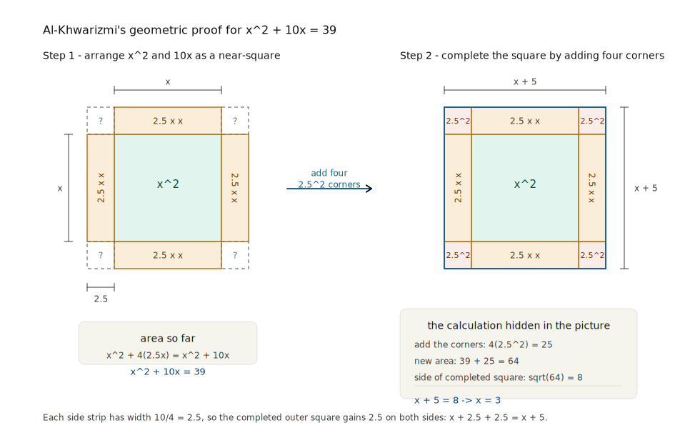

# Chapter Six: The House of Wisdom
### *Baghdad, 750–1258 CE*

---

In the year 830 CE, a scholar in Baghdad sat down to write a book whose opening sentence tells us everything we need to know about what motivated it.

His name was Muhammad ibn Musa al-Khwarizmi, and he had been working at the court of the Abbasid Caliph al-Ma'mun for several years, in an institution called the Bayt al-Hikma — the House of Wisdom. He dedicated his new book to the Caliph, as was customary, and then explained what it was for. He wrote that he intended to teach, in his own words:

*"what is easiest and most useful in arithmetic, such as men constantly require in cases of inheritance, legacies, partition, lawsuits, and trade, and in all their dealings with one another, or where the measuring of lands, the digging of canals, geometrical computations, and other objects of various sorts and kinds are concerned."*

Inheritance. Legacies. Lawsuits. Trade. Land. Canals.

We have heard this list before, in different languages. The Babylonian accountant pressed his reed into clay to manage grain and tax. The Egyptian rope-stretcher measured fields and pyramid slopes. Aryabhata solved congruences to align the calendar. And now al-Khwarizmi, working in the wealthiest and most cosmopolitan city on earth, was writing for judges and merchants and administrators who needed a reliable method for solving the equations that arose in the daily business of a complex society.

The book he wrote — *Al-Kitāb al-mukhtaṣar fī ḥisāb al-jabr wal-muqābala*, usually shortened to *Al-Jabr* — gave the world the word algebra. It also gave the world something more important than the word: the discipline stated in an unusually general, systematic, teachable form.

---

## The City That Built Itself in a Circle

To understand the House of Wisdom, you first need to understand Baghdad.

The city did not exist before 762 CE. The second Abbasid Caliph, al-Mansur — the same caliph who had summoned the Indian astronomer Kankah and ordered the translation of Brahmagupta's text — commissioned it from nothing, choosing a site on the western bank of the Tigris where the river bends close to the Euphrates and the land is flat and fertile. He hired one hundred thousand workers to build it, and he built it in the shape of a perfect circle.

The Round City of al-Mansur was an act of geometry as much as urban planning. The circular design was calculated for maximum defensibility — every point on the wall was equidistant from the central palace, so no attacker could concentrate force at a corner. The four gates were aligned precisely with the cardinal directions. The streets radiated outward from the palace at regular intervals. The city was, in its plan, a mathematical object: an idea made physical by the labour of a hundred thousand people.

It grew fast. Within a generation, Baghdad had outgrown its circular walls and sprawled across both banks of the Tigris into a city of perhaps a million inhabitants — the largest in the world at that time, and at least twenty times larger than any city in contemporary Europe. Rome, which had once held a million people at its imperial peak, now held perhaps fifty thousand. Constantinople held several hundred thousand. Baghdad held a million, growing.

The wealth of this city was extraordinary. The Abbasid caliphate sat astride the most lucrative trade routes in the world: the overland silk roads connecting China to the Mediterranean, and the sea routes connecting the Persian Gulf to India, East Africa, and Southeast Asia. Every caravan that passed through Mesopotamia paid taxes. Every merchant who docked in Basra paid duties. The caliphate collected these revenues and spent them, among other things, on scholars.

This is the context in which the House of Wisdom — the Bayt al-Hikma — must be understood. Not as a romantic academy rising spontaneously from intellectual ambition, but as an institution of the state, funded by extraordinary wealth, in service of practical goals: better astronomical tables for the calendar and for navigation, better maps for administration and military planning, better mathematics for the courts and counting houses. The scholarship was real and it was profound. But it was also, from the beginning, in the service of empire.

---

## What the House of Wisdom Actually Was

There is a version of this story — told in many popular books and celebrated with genuine enthusiasm — in which the House of Wisdom was a vast, bustling academy where scholars of every faith and tongue gathered under golden domes to translate the wisdom of the ancients and debate the frontiers of knowledge, while the Caliph wandered benevolently among them, encouraging breakthroughs with patronage and conversation.

This version is not entirely wrong, but it is considerably more romantic than the evidence supports, and honesty requires acknowledging the scholarly debate.

The historian Dimitri Gutas, whose meticulous work on the Abbasid translation movement has reshaped our understanding of this period, argues that the Bayt al-Hikma was primarily an administrative library — a bureau for collecting, storing, and copying texts, originally focused on translating Persian administrative and literary texts into Arabic, and only later acquiring an association with mathematical and astronomical work. The great translators of Greek scientific texts into Arabic — men like Hunayn ibn Ishaq, who translated virtually all of Galen and much of Aristotle — did not work inside the Bayt al-Hikma. They worked in their own houses, in the houses of wealthy patrons, and in the workshops of private book dealers. The grand central academy is, in some measure, a later legend attached retrospectively to a more dispersed and complicated reality.

What was real, and what cannot be overstated, was the intellectual culture of ninth-century Baghdad as a whole. Whether the translation movement was centred in one building or distributed across a city, it happened. Hundreds of Greek, Sanskrit, Syriac, and Persian texts were translated into Arabic within a few generations — the most ambitious and systematic translation enterprise in the history of the world up to that point. The patronage was real: wealthy individuals, as well as the caliphs, paid translators generously. Hunayn ibn Ishaq was reportedly paid the weight of each translated book in gold. The demand was genuine: merchants, administrators, physicians, astronomers, and legal scholars needed the knowledge in these texts, and they were willing to fund its transfer into their language.

The result was that Arabic became, within a century, the international language of science — the Latin of its era, the medium through which the accumulated mathematical knowledge of Babylon, Greece, India, and Persia was made accessible to anyone who could read it. And it was in this environment of access, cross-pollination, and practical demand that al-Khwarizmi sat down to write his book on algebra.

---

## The Father of Algebra and His Geometric Proofs

Al-Khwarizmi's *Al-Jabr* is a strange book to modern eyes, and the strangeness illuminates something important.

It has no symbols. None at all. The entire text is written in words. What we would write as x² + 10x = 39, al-Khwarizmi writes as: "a square and ten roots equal thirty-nine." What we would write as x = √(25) − 5, he writes as: "take the root of twenty-five, which is five, and subtract five from it." Every equation is a sentence. Every solution is a paragraph. The algebra is entirely rhetorical — no letters, no operational symbols, no equals sign. Just Arabic prose, precise and careful.

This is not because al-Khwarizmi was mathematically naive. It is because the symbolic notation that we think of as essential to algebra — the a's and b's and x's, the +, −, ×, ÷, = — had not been invented yet. Symbolic algebra is a European development of the fifteenth and sixteenth centuries, built on the mathematical ideas that al-Khwarizmi was formulating but expressed in a notational system he never had. What he did have was the ideas themselves: the systematic classification of equation types, the general procedures for solving them, and the insistence that these procedures be demonstrated, not just stated.

That last point — the demonstration — is what makes *Al-Jabr* something new. Al-Khwarizmi did not simply list recipes, the way Babylonian scribes had. For each type of equation, he provided a geometric proof: a demonstration, using the Greek tradition of geometric argument, that the procedure he gave was necessarily correct. He was fusing two traditions — the practical computational algebra of the Indian and Babylonian inheritance with the demonstrative proof culture of the Greeks — into something neither tradition had achieved alone: a general, systematic, proved theory of equation-solving.

His classification scheme covered six types of equations — the combinations of squares, roots, and constants that can appear when you insist all coefficients be positive (he did not work with negative coefficients, reflecting the incomplete acceptance of negative numbers in his tradition). For each type, he gave the procedure and proved it. The proof for what we would call the quadratic equation used a geometric construction: completing the square, drawn literally as a square being completed, with side lengths representing unknowns and areas representing their squares.

This geometric demonstration is worth pausing over, because it shows al-Khwarizmi's method at its clearest.

Consider the equation we would write as x² + 10x = 39. Al-Khwarizmi's procedure: halve the number of roots (10 ÷ 2 = 5), square that half (5² = 25), add it to the number (25 + 39 = 64), take the square root (√64 = 8), subtract the half (8 − 5 = 3). The answer is x = 3.

Check: 3² + 10 × 3 = 9 + 30 = 39. Correct.

But why does this work? Al-Khwarizmi proved it geometrically. Draw a square with side x — its area is x². Attach four rectangles to its sides, each with width 10/4 = 2.5 and length x — their total area is 10x. The figure so far has area x² + 10x = 39. Now complete the four corners with small squares, each of side 2.5 — their total area is 4 × (2.5)² = 25. The completed figure is a large square with area 39 + 25 = 64, so its side is √64 = 8. The side of the large square equals x + 2 × 2.5 = x + 5. Therefore x + 5 = 8, so x = 3.

{fig-alt="A two-panel geometric diagram of al-Khwarizmi's completing-the-square proof for x squared plus 10x equals 39. The left panel shows a central square labeled x squared with four attached rectangles of area 2.5 times x; the right panel adds four corner squares of area 2.5 squared to form a larger square of side x plus 5, with a calculation box deriving x equals 3." width="94%"}

The procedure — halve, square, add, root, subtract — is precisely what the geometry demands. The proof is not a separate justification tacked on afterward; it is the source of the procedure. The geometry shows you *why* each step is what it is.

Al-Khwarizmi was completing the square. Literally. With an actual square. In a picture.

---

## Two Words That Run the World

The title of al-Khwarizmi's algebra book — *Al-Jabr wal-Muqābala* — contains two technical terms for the two operations he used to simplify equations.

*Al-jabr* meant restoration: the operation of moving a subtracted term from one side of an equation to the other, adding it to both sides to make it positive again. If you had "a square minus four equals twelve," you would restore the subtracted four by adding it to both sides to get "a square equals sixteen." You were restoring the missing quantity.

*Al-muqābala* meant balancing: the operation of cancelling equal terms on opposite sides of an equation. If you had "a square plus ten equals a square plus four," you would balance them by removing the square from both sides to get "ten equals four" — which has no solution, revealing an impossibility.

*Al-jabr* passed through Latin as *algebrāica*, then *algebra*. The restoration of a subtracted term became the name of a whole mathematical discipline.

Al-Khwarizmi himself — or rather, his name — had an equally remarkable fate. His works were translated into Latin in the twelfth century, and the Latin translator rendered his name as *Algoritmi* — a Latinisation of *al-Khwarizmi* that preserved the sound but lost the meaning. A later reader, encountering texts that began "Algoritmi says..." or "According to Algoritmi...", took the word to be not a name but a description of a method. Over centuries of use and mistranslation, *Algoritmi* became *algorismus*, then *algorism*, then *algorithm*: a word that now means any finite, systematic, step-by-step procedure for solving a problem.

The word *algebra* comes from an operation al-Khwarizmi described. The word *algorithm* comes from his name. Two of the most consequential words in the language of modern science and technology were both derived, by different paths, from one scholar working in ninth-century Baghdad.

And every time a computer executes a program — following a sequence of instructions, step by deterministic step, until it reaches a solution — it is, in the most literal etymological sense, performing an *algorithm*. Al-Khwarizmi is in the machine.

---

## The Inheritance Problem

Al-Khwarizmi was explicit that his primary practical audience was judges and administrators dealing with Islamic inheritance law — and this context is worth understanding, because it makes the chapter's thesis vivid.

Islamic law of inheritance is intricate. The Quran specifies fixed fractional shares for different categories of heirs: a husband receives half his wife's estate in the absence of children, a quarter if there are children; a wife receives an eighth of her husband's estate if there are children, a quarter otherwise; a daughter receives half of what a son receives when there are children of both sexes; and so on through parents, siblings, and more distant relatives in a web of specified fractions that must together sum to the whole estate.

In a simple case — one wife, one son, one daughter — the arithmetic is manageable. But estates are rarely simple. They have debts to be subtracted first. They have bequests to non-heirs, limited by Islamic law to one-third of the estate. There are disputes over whether certain relatives are legitimate heirs. The estate includes illiquid assets whose value is uncertain. A judge settling a complex estate needed not just arithmetic but algebra: the ability to set up an equation in which the unknown is the share of one heir, and solve for it given the fixed relationships between all the shares.

Al-Khwarizmi's book devoted its final section to exactly these cases. He gave worked examples of inheritance problems, setting them up as equations of the types he had classified and solved in the earlier sections. The algebra was not introduced and then applied to inheritance as an afterthought — it was developed precisely *because* inheritance required it.

This is the book's argument in miniature, and it is the argument of this whole history: the practical problem came first, and the mathematics grew to meet it. The Babylonians developed positional notation and compound interest because they managed granaries and made loans. The Egyptians developed the frustum formula because they built monuments. Aryabhata developed the kuttaka because the calendar required it. Al-Khwarizmi developed systematic algebra because Islamic courts required a reliable, teachable, demonstrably correct method for dividing estates.

The mathematics outlasted the estates. It always does.

---

## The Other Scholars

Al-Khwarizmi was the most influential figure of the Baghdad mathematical renaissance, but he was not alone, and the others deserve more than a footnote.

The Banū Mūsā were three brothers — Muhammad, Ahmad, and al-Hasan, sons of a famous astrologer — who used their inherited wealth and connections to the Caliph's court to fund both translations and original research. They hired the best translators in Baghdad, including the great Hunayn ibn Ishaq and the mathematician Thābit ibn Qurra, and they did substantial mathematical work themselves. Their *Book of Ingenious Devices* — a treatise on mechanical devices including automata, fountains, and trick vessels — is an early work in what would later be called mechanical engineering, applying mathematics to the design of machines. Their work on geometry extended the Greek tradition: they gave a new proof of the theorem that the angle in a semicircle is always a right angle, and they investigated conic sections with a depth not seen since Apollonius.

Thābit ibn Qurra (836–901 CE) is one of the more remarkable figures of the entire medieval period. Born into the Sabian religion in the city of Harran (in what is now southeastern Turkey), he was recruited to Baghdad by the Banū Mūsā specifically for his mathematical talent and his mastery of Syriac, Arabic, and Greek. He translated an enormous number of Greek mathematical texts into Arabic — including works of Archimedes, Euclid, Ptolemy, and Apollonius — and in many cases he did not merely translate but extended and improved. His translation of Archimedes' work on the measurement of the circle included corrections to Archimedes' arithmetic and extensions of his method. He discovered an elegant formula for generating pairs of *amicable numbers* — pairs like 220 and 284, where each number equals the sum of the proper divisors of the other — that would not be improved upon for seven centuries.

Al-Battani (858–929 CE), working in Raqqa on the Euphrates, was the greatest observational astronomer between Hipparchus and Tycho Brahe. He made new measurements of the length of the solar year, the obliquity of the ecliptic, and the precession of the equinoxes, all more accurate than anything in the Greek tradition. He introduced the use of sines and cosines into astronomy in place of the chord-based system of Hipparchus — a direct transmission of the Indian trigonometric tradition, absorbed through al-Khwarizmi's generation and refined by al-Battani into a form that European astronomers would use until the Renaissance. Copernicus cited al-Battani by name. So did Tycho Brahe, and Galileo.

Ibn al-Haytham (965–1040 CE), working in Cairo under the Fatimid Caliph al-Hakim, produced his *Book of Optics* — one of the most important scientific books ever written. He established, by experiment and mathematical analysis, that vision works by light entering the eye rather than rays emanating from it (the Greek view). He developed a geometrical theory of lenses and mirrors that correctly predicted the formation of images, the behaviour of curved mirrors, and the phenomenon of the camera obscura. He was the first person to use the controlled experiment as a systematic method for establishing scientific truth. The *Book of Optics* was translated into Latin in the late twelfth century, and its influence on European optics — on Bacon, on Pecham, eventually on Kepler and Newton — was direct and traceable.

And there was al-Biruni (973–1048 CE), perhaps the most extraordinary polymath of the medieval world: a scholar who mastered Arabic, Persian, Sanskrit, and Greek, who spent years in India studying its science and culture with a rigor that was genuinely ethnographic, who calculated the radius of the Earth using a method of his own devising from the top of a hill in Pakistan to within a few percent of the modern value, who wrote on geography, history, pharmacology, mineralogy, astronomy, and mathematics with equal depth and accuracy. His *Canon of Masud*, dedicated to Sultan Masud of Ghazni, is a comprehensive astronomical treatise that synthesises the Greek, Indian, and Islamic traditions and adds substantial original work. It is, among many other things, an extended meditation on the relationship between mathematical models and physical reality — on what it means for a mathematical theory to be "true" of the world.

---

## What Was Genuinely New

It is important to be precise about what the Islamic scholars did and did not contribute, because the question has been muddied in both directions — some historians portraying the Islamic world as merely preserving the Greek tradition and passing it along to Europe, others overcorrecting by claiming that every important idea in European science was really Islamic in origin.

The truth is more interesting than either caricature.

The Islamic mathematicians did preserve the Greek tradition. This was enormously important — without the Arabic translations, many Greek texts would simply be lost, because the original Greek manuscripts decayed or were destroyed while the Arabic copies survived. The Almagest of Ptolemy, the works of Archimedes, large portions of Euclid and Apollonius — these survived the collapse of the Roman world precisely because they were translated into Arabic while there was still an institutional capacity to do so.

But preservation was the smallest part of what happened. The Islamic scholars absorbed the Greek tradition, tested it against the Indian and Babylonian traditions they had also absorbed, found the gaps and contradictions, and pushed beyond them.

Al-Khwarizmi did not just transmit Babylonian and Indian equation-solving: he systematised it, classified it, and helped turn it into a more general and demonstrative discipline. His algebra was genuinely new, not because the individual techniques were novel but because the form — systematic, general, demonstrated, teachable — had never been achieved before.

Al-Battani did not just copy Ptolemy's trigonometry: he measured its errors, corrected them with better observations, and reformulated it using the Indian sine and cosine in place of the Greek chord, making it more computationally tractable. His astronomy was more accurate than Ptolemy's precisely because he was not simply copying.

Ibn al-Haytham did not just transmit Greek optics: he overturned the central Greek claim about vision, replaced it with a correct theory derived from experiment and mathematical analysis, and built a framework for optics that would last six centuries.

Al-Biruni did not just describe India: he approached it as a scientist, checking claims against evidence, comparing traditions, noting where they agreed and where they diverged, and drawing conclusions with appropriate epistemic humility. His *India* is one of the most remarkable early examples of comparative cultural scholarship.

What the Islamic Golden Age created was not a relay station between ancient wisdom and modern science. It was a five-century period of original, creative, rigorous intellectual work that transformed what it inherited and produced results that could not have been produced by either the Greek or the Indian tradition alone. The synthesis was the achievement.

---

## The Language Problem and the European Renaissance

Arabic became the international language of science in the ninth and tenth centuries in the same way that Latin had been in the Roman world and English is today: not because it was inherently better suited to scientific thought, but because the institutions and the wealth that funded science happened to be organised around it.

By the eleventh century, that organisation was beginning to shift. The Abbasid Caliphate was weakening under the pressure of the Seljuk Turks, who took effective control of Baghdad in 1055 CE. The centre of intellectual gravity began moving westward: to the courts of Muslim Spain, where a flourishing culture had developed in cities like Cordoba and Toledo; and to the Norman kingdom of Sicily, where Arabic, Greek, and Latin scholarship coexisted at court.

Toledo, captured by Christian kingdoms from the Moors in 1085 CE, became the main conduit through which Arabic — and through Arabic, Greek — scientific texts entered Europe. Scholars came from across the Christian world to Toledo specifically to translate: from Arabic into Latin, sometimes via an intermediate translation into Romance. It was in Toledo in 1145 CE that Robert of Chester translated al-Khwarizmi's *Al-Jabr* into Latin under the title *Liber algebrae et almucabola* — and algebra entered the European mathematical tradition.

The impact was immediate and lasting. Within a generation, European scholars were working with algebraic methods they had never had before. Within two generations, they were extending those methods. By the fifteenth century, Italian mathematicians were competing with each other to solve cubic and quartic equations — the next problems beyond the quadratics that al-Khwarizmi had treated — using the algebraic framework he had established.

The transmission had a cultural dimension worth noting. When European scholars absorbed the Arabic mathematical tradition, they did not always acknowledge its origins clearly. The Hindu-Arabic numerals — the decimal positional system including zero, derived from India and transmitted through the Islamic world — became known simply as "Arabic numerals" in Europe, losing their Indian origin in the transit. Al-Khwarizmi's name was corrupted to a common noun. Al-Battani's observations were cited in Latin texts without always naming him. The Islamic mathematicians whose work underpinned the European Renaissance were, in many cases, systematically un-named as their ideas were absorbed.

This pattern — of ideas travelling across cultural boundaries and losing their attribution in transit — is one that we have already seen with Kerala, and will see again. It is one of the reasons why this book exists: to try to follow the ideas back to the people who actually had them, regardless of which tradition eventually got the credit.

---

## The End of the Golden Age

In the winter of 1258 CE, the Mongol army of Hulagu Khan — grandson of Genghis Khan — arrived at the walls of Baghdad. The Abbasid Caliph al-Musta'sim refused to surrender. The siege lasted less than two weeks. The city fell on February 13th.

What followed was one of the most catastrophic destructions of accumulated knowledge in human history. The accounts of what happened are harrowing even at eight centuries' remove. The House of Wisdom was destroyed. The libraries — hundreds of thousands of manuscripts, the written memory of five centuries of scholarship — were thrown into the Tigris. The river, according to the Arabic chroniclers, ran black with ink. The irrigated agricultural system of Mesopotamia, built up over millennia, was systematically dismantled, and the land returned to desert within a generation. Baghdad, which had held a million people, was reduced to a fraction of that. The centre of the Islamic intellectual world never fully recovered.

The Mongol destruction of Baghdad is sometimes presented as the end of the Islamic Golden Age, and in terms of institutional continuity, this is roughly true. But the ideas had already escaped. The translations had been made. The algebra was in Toledo, in Palermo, in the university libraries of Bologna and Paris. Al-Battani's observations were in the hands of astronomers who would use them to correct the Ptolemaic tables. Ibn al-Haytham's optics were in the hands of scholars who would use them to design lenses. The mathematics was alive in a hundred European hands, and it did not need Baghdad anymore.

The destruction of the city was a catastrophe for its inhabitants — for the scholars, the merchants, the craftsmen, the ordinary people who died in their hundreds of thousands. But it could not unmake what the centuries of intellectual work had built. You can burn a library. You cannot unlearn what has already been learned.

---

## The Bridge to the Ocean

The line from Baghdad to the Kerala coast is not direct, but it is real.

The Indian astronomical tradition that Mādhava inherited — the *siddhānta* texts of Aryabhata and Brahmagupta — was available in its original Sanskrit in Kerala. But the Islamic development of trigonometry, above all al-Battani's refinement of the sine and cosine tables and the systematic use of these functions in planetary models, was also known to Kerala scholars through channels that historians are still tracing. The Malabar coast was, as we have seen, a hub of the Arabian Sea trade, and Arab scholars and merchants were regular visitors to its ports.

Whether Mādhava knew specific Islamic mathematical results, or whether the Kerala school developed its infinite series independently of any Islamic influence, remains an open question. What is clear is that the mathematical culture of the Islamic Golden Age had raised the standard for what precise astronomical computation meant. The demand for ten decimal places of accuracy in trigonometric tables — the demand that drove Mādhava to infinite series — was partly the demand of a world in which al-Battani's nine-century-old precedent for precise observation had become the baseline.

The Golden Age did not produce Kerala. But it raised the bar that Kerala had to clear.

---

## What Baghdad Gave Mathematics

The accounting, at the end of Chapter 6, is straightforward.

The word algebra is Arabic, and Baghdad was one of the places where equation-solving took on a systematic, general, and teachable classical form. It was transmitted to Europe via Toledo and Palermo and absorbed into a European mathematical tradition that eventually, by the sixteenth and seventeenth centuries, outpaced its source. This is not a tragedy but a tribute: ideas that are genuinely powerful propagate, and they eventually outgrow the institutions that first housed them.

The decimal number system — the system you use to write every number, from your bank balance to the distance to the moon — is Indian in origin and was transmitted to Europe through Islamic mathematics. The numerals are called Arabic because that is the route they took. The modern term "Hindu-Arabic numerals" captures their Indian origin and Arabic transmission more accurately.

The word *algorithm* is a monument to al-Khwarizmi, built from his own name by the slow erosion of centuries of translation and transmission. Every line of computer code that has ever been written is, etymologically, an act of homage to a scholar in ninth-century Baghdad who wanted to help judges divide estates fairly.

And the culture — the extraordinary, five-century-long culture that believed knowledge was worth having for its own sake, worth paying for, worth seeking across every linguistic and cultural barrier — that culture transformed what it inherited and gave what it created to a world that would not always remember where it came from.

It is enough to know where it came from. That is what this book is for.

---

*In the next chapter, we return to India — to the southwestern coast, to a green and rain-soaked strip of land between the Western Ghats and the Arabian Sea. The monsoon has just ended. The stars are very bright. A mathematician named Mādhava is about to discover something that nobody on earth has yet imagined.*

---
