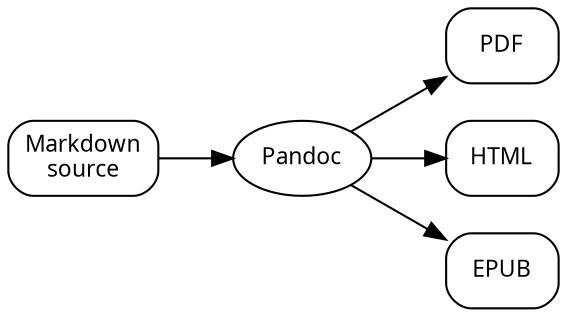
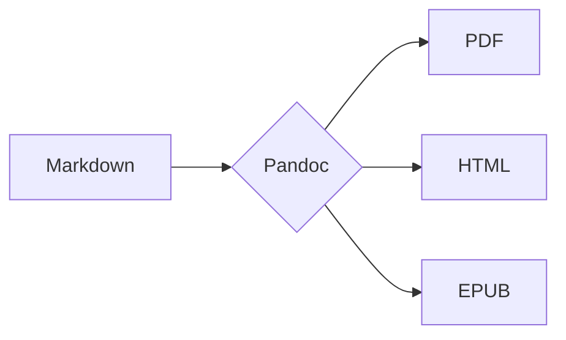
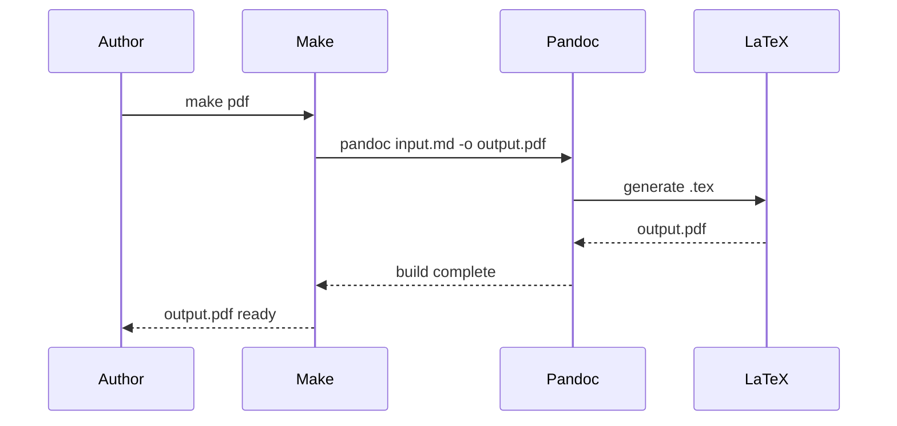

# Diagrams and Figures from the CLI

Text alone cannot do everything a technical document needs. Flowcharts, architecture diagrams, data plots, circuit schematics, mathematical figures, state machines, dependency graphs — these are not decorations. They carry information that prose conveys poorly, and they do so through visual relationships that the reader can grasp at a glance. For the CLI typographer, the question is not whether to include figures, but how to produce them without reaching for a GUI application.

The answer is a set of text-based diagram tools: programs that take a description of what the diagram should contain and produce an image. The description might be a graph in DOT language, a script in Python, a drawing in TikZ, or a flowchart in Mermaid syntax. In every case, the diagram is a file that can be committed to version control, diffed, reviewed, and automated — not a binary blob dropped from a drawing application.

This chapter covers the main tools and their niches, the formats that work best for each output medium, and the workflows for integrating generated figures into Pandoc, LaTeX, and Typst documents.


## Choosing the right format

Before choosing a diagram tool, choose the output format. The diagram's purpose in the document determines which format is correct, and the format constrains which tools are appropriate.

**SVG** is the right format for diagrams in HTML output. It is resolution-independent (the diagram looks sharp at any screen density), its text content is selectable and searchable, and it integrates naturally with CSS. The file size is typically small for line diagrams. SVG can also be used in PDF output when converted to PDF format first, or embedded directly in PDF by some engines.

**PDF** is the right format for diagrams in LaTeX PDF output. TikZ produces PDF natively (as part of the document); Graphviz and other tools can output PDF directly; SVG files can be converted to PDF with `pdftocairo`, `inkscape`, or `rsvg-convert`. Embedded PDFs in a LaTeX document are rendered at full resolution.

**PNG** at adequate resolution (150–300 dpi for screen, 300–600 dpi for print) works for both HTML and PDF output. It is raster rather than vector, so it does not scale cleanly, but it is universally supported and is the right choice for diagrams with complex gradients or photographic content that SVG cannot represent well.

**EPS** (Encapsulated PostScript) is the older format for LaTeX figures. It is still accepted by some publishers and older LaTeX workflows. Graphviz can output EPS; `pdftocairo -eps` converts PDFs to EPS. For new work, PDF is preferable.

The practical default for CLI diagram production: generate SVG for HTML output, PDF for LaTeX output. If a tool produces only one format, convert as needed.


## Graphviz: graphs and networks

Graphviz is the standard tool for automatically laying out graphs — directed and undirected networks of nodes connected by edges. It is appropriate whenever the structure matters more than the precise position: dependency graphs, state machines, call graphs, organisational charts, network topology, data flow diagrams.

Install Graphviz on Debian/Ubuntu: `apt install graphviz`. It provides six layout programs, each suited to different graph structures.

### The DOT language

Graphviz diagrams are written in DOT, a declarative language that describes nodes, edges, and their attributes:



`digraph` introduces a directed graph (arrows); `graph` introduces an undirected graph (lines). `rankdir=LR` sets the layout direction to left-to-right; the default is top-to-bottom. `node [...]` sets default attributes for all nodes; individual nodes can override these.

Compile to SVG, PDF, or PNG:

```sh
dot -Tsvg pipeline.dot -o pipeline.svg
dot -Tpdf pipeline.dot -o pipeline.pdf
dot -Tpng -Gdpi=150 pipeline.dot -o pipeline.png
```

### Layout engines

The `dot` program uses a hierarchical layout appropriate for directed graphs with a natural direction (top-to-bottom or left-to-right flows). For other graph structures, different layout engines are more appropriate:

```sh
neato  # spring model — good for undirected graphs and networks
fdp    # force-directed — similar to neato, larger graphs
sfdp   # scalable force-directed — very large graphs
twopi  # radial layout — circular arrangement around a root node
circo  # circular layout — regular ring arrangement
```

All accept the same DOT input and produce the same output formats. The choice of engine is a matter of what looks best for the specific graph structure.

### Styling

Graphviz supports a rich set of visual attributes. The key attributes for professional-quality diagrams:

**Node shapes**: `box`, `ellipse`, `circle`, `diamond`, `doublecircle`, `plaintext`, `note`, `tab`, `folder`, `record`. The `record` shape creates structured multi-field nodes:

```dot
node [shape=record, fontname="sans-serif", fontsize=10];
font [label="{ Font file | { Family | Style } | { OTF | TTF } }"];
```

**Colors and fills**: Use named colors (`lightblue`, `lightyellow`) or hex values. Set `style=filled` to enable fill colour, `fillcolor="#e8f4fb"` for the fill, and `color="#666666"` for the border:

```dot
node [style=filled, fillcolor="#f0f8ff", color="#999999"];
```

**Subgraphs and clusters**: Grouping related nodes in a `subgraph cluster_name { }` draws a box around them:

```dot
subgraph cluster_outputs {
    label="Outputs";
    style=dashed;
    color=gray;
    pdf; html; epub;
}
```

**Transparency and backgrounds**: Set `bgcolor="transparent"` on the graph for a transparent background, which integrates cleanly when embedded in documents with non-white backgrounds.

### When not to use Graphviz

Graphviz is for graphs: nodes and edges. It is the wrong choice for diagrams where spatial position or layout geometry is important — flowcharts where specific branching positions matter, architectural diagrams where the spatial relationships convey meaning, or any diagram where the automatic layout produces results that do not match the intended structure. For those cases, TikZ (for LaTeX) or a manual SVG gives more control.


## TikZ: programmatic drawing in LaTeX

TikZ (a recursive acronym for "TikZ ist kein Zeichenprogramm" — TikZ is not a drawing program) is the LaTeX package for programmatic vector graphics. It is the natural choice for diagrams in LaTeX documents: the diagram is typeset as part of the document, uses the same fonts, and can reference LaTeX commands, counters, and defined lengths.

TikZ is comprehensive and complex. The TikZ manual runs to over 1200 pages. This section covers the patterns needed for technical documentation; the rest can be learned by example and reference.

### Basic structure

TikZ diagrams live inside a `tikzpicture` environment:

```latex
\usepackage{tikz}
\usetikzlibrary{arrows.meta, positioning, shapes.geometric}

\begin{tikzpicture}[
    node distance=2cm,
    box/.style={
        rectangle, rounded corners=4pt, draw=gray!60, line width=0.5pt,
        minimum width=2.5cm, minimum height=0.8cm, text centered,
        font=\small\sffamily
    }
]
    \node[box, fill=blue!10]   (md)     {Markdown};
    \node[box, fill=orange!15, right=of md] (pandoc) {Pandoc};
    \node[box, fill=green!10,  right=of pandoc] (pdf) {PDF};

    \draw[-{Stealth}] (md)     -- (pandoc);
    \draw[-{Stealth}] (pandoc) -- (pdf);
\end{tikzpicture}
```

The `[...]` after `\begin{tikzpicture}` sets defaults for the whole diagram. The `node distance=2cm` sets the default spacing for the `positioning` library's `above=of`, `right=of`, and `below=of` placement commands. Named styles (`.style={...}`) define reusable attribute sets.

### Standalone diagrams

For diagrams that need to be used outside LaTeX — in Pandoc HTML output, in Typst, or as standalone figures — compile them with the `standalone` class:

```latex
\documentclass{standalone}
\usepackage{tikz}
\usetikzlibrary{arrows.meta, positioning}

\begin{document}
\begin{tikzpicture}[...]
    % diagram content
\end{tikzpicture}
\end{document}
```

The `standalone` class sizes the PDF page tightly to the diagram content. Compile and convert to SVG:

```sh
pdflatex diagram.tex
pdftocairo -svg diagram.pdf diagram.svg
```

`pdftocairo` from the `poppler-utils` package is the cleanest SVG output from TikZ. The result is a precise SVG with correct fonts and geometry.

### TikZ libraries

TikZ's functionality is extended by libraries, loaded with `\usetikzlibrary{}`:

- `arrows.meta` — modern arrowhead styles (`{Stealth}`, `{LaTeX}`, `{Circle}`)
- `positioning` — relative node placement (`right=2cm of nodename`)
- `shapes.geometric` — additional node shapes (diamond, trapezium, cylinder)
- `fit` — nodes that automatically size to contain other nodes
- `calc` — coordinate arithmetic (`$ (a)!0.5!(b) $` for midpoints)
- `matrix` — table-like layouts of nodes
- `decorations` — decorative path effects (wavy lines, braces)
- `shadows` — drop shadow effects (use sparingly)

For PGFPlots (data plotting within LaTeX), the separate `pgfplots` package provides `\begin{axis}` environments for function plots, scatter plots, bar charts, and more, all typeset with LaTeX fonts.


## Mermaid: diagrams from text in web contexts

Mermaid is a JavaScript library and CLI tool that renders diagrams from a text description. It is particularly well-suited for Markdown documentation and web contexts, where diagrams can be embedded as Mermaid source blocks and rendered client-side by a JavaScript include, or pre-rendered to SVG by the CLI tool.

Mermaid supports a wide range of diagram types with a simple, readable syntax:

**Flowcharts:**



**Sequence diagrams:**



**Class diagrams, entity-relationship diagrams, state diagrams, Gantt charts**, and several others are also supported.

### CLI generation

The Mermaid CLI (`mmdc`) converts Mermaid source to SVG, PNG, or PDF:

```sh
npm install -g @mermaid-js/mermaid-cli

# Generate SVG
mmdc -i diagram.mmd -o diagram.svg

# Generate PNG at specific size
mmdc -i diagram.mmd -o diagram.png -w 800 -H 600

# With a custom CSS theme
mmdc -i diagram.mmd -o diagram.svg --cssFile theme.css
```

Mermaid CLI requires a Chrome or Chromium browser for rendering. On headless servers, Puppeteer's bundled Chromium is used. The initial setup involves installing Puppeteer's Chrome dependency:

```sh
npx puppeteer browsers install chrome-headless-shell
```

### Mermaid in GitHub and documentation platforms

Most documentation platforms — GitHub, GitLab, Notion, Confluence, and many static site generators — render Mermaid blocks natively. In these contexts, no pre-processing is needed: write the Mermaid syntax in a fenced code block and the platform renders it.

For Pandoc-based HTML output, Mermaid diagrams can be rendered by including the Mermaid JavaScript library in the HTML template and using fenced code blocks with the `mermaid` class — Mermaid detects and renders them automatically:

```html
<!-- In Pandoc HTML template or --include-after-body -->
<script src="https://cdn.jsdelivr.net/npm/mermaid/dist/mermaid.min.js"></script>
<script>mermaid.initialize({startOnLoad: true});</script>
```

For PDF output, the CLI pre-render to SVG is the practical path.


## D2: a modern alternative to DOT

D2 is a newer diagram scripting language with a cleaner syntax than DOT and built-in support for multiple layout engines, including TALA (a proprietary layout engine optimised for software architecture diagrams). It is worth knowing for new projects that do not need to integrate with existing Graphviz tooling.

```d2
# Pipeline diagram in D2
direction: right

md: Markdown {shape: page}
pandoc: Pandoc {shape: oval}
outputs: {
    pdf: PDF {shape: document}
    html: HTML {shape: document}
    epub: EPUB {shape: document}
}

md -> pandoc
pandoc -> outputs.pdf: via LaTeX
pandoc -> outputs.html
pandoc -> outputs.epub
```

```sh
d2 diagram.d2 output.svg
d2 --layout=elk diagram.d2 output.svg   # use ELK layout engine
d2 --theme=200 diagram.d2 output.svg    # numbered themes
```

D2 is still maturing, but its syntax is noticeably more readable than DOT for complex diagrams, and its layout results for software architecture diagrams tend to be better than Graphviz's default `dot` layout.


## Data plots with gnuplot and Python

Technical documents often contain charts generated from data — performance benchmarks, experimental results, statistical summaries. These need to be generated programmatically from data sources rather than drawn manually.

**gnuplot** is the traditional Unix tool for this. It produces high-quality plots for printed documents, with excellent PostScript and PDF output:

```gnuplot
# reading-speeds.gnuplot
set terminal svg size 600,400 font "sans-serif,11"
set output "reading-speeds.svg"

set xlabel "Point size"
set ylabel "Words per minute"
set key top left
set border 3
set tics nomirror
set style data linespoints

plot "data.txt" using 1:2 title "Garamond", \
     "data.txt" using 1:3 title "Palatino", \
     "data.txt" using 1:4 title "Times"
```

```sh
gnuplot reading-speeds.gnuplot
```

gnuplot's syntax is idiosyncratic but powerful. For publication-quality academic figures, it remains the tool of choice in many scientific communities.

**Python with matplotlib** offers a more programmable alternative with a larger ecosystem of extensions. For complex data manipulation before plotting, for interactive exploration before committing to a final figure, or in projects already using Python for computation, matplotlib is often the practical choice:

```python
import matplotlib.pyplot as plt
import matplotlib as mpl
import numpy as np

# Use a style that matches your document's aesthetics
mpl.rcParams.update({
    'font.family':      'serif',
    'font.serif':       ['EB Garamond', 'Georgia'],
    'font.size':        11,
    'axes.spines.top':  False,
    'axes.spines.right': False,
    'figure.dpi':       150,
})

fig, ax = plt.subplots(figsize=(6, 4))

typefaces = ['Garamond', 'Palatino', 'Times']
sizes = [9, 11, 14]
speeds = [[220, 255, 268], [225, 258, 271], [218, 250, 265]]

x = np.arange(len(typefaces))
for i, (size, vals) in enumerate(zip(sizes, zip(*speeds))):
    ax.bar(x + i*0.25, vals, 0.25, label=f"{size}pt")

ax.set_xticks(x + 0.25)
ax.set_xticklabels(typefaces)
ax.set_ylabel("Words per minute")
ax.legend(frameon=False, title="Size")

# Save as SVG for HTML, PDF for LaTeX
fig.savefig("reading-speeds.svg", format="svg", bbox_inches="tight")
fig.savefig("reading-speeds.pdf", format="pdf", bbox_inches="tight")
```

The `rcParams` settings at the top establish document-consistent typography for the plot. Matching the plot's font to the document's body font is the single most important step toward figures that look like they belong in the document rather than having been imported from a different context.


## Integrating diagrams in documents

### In Pandoc Markdown

For HTML output, SVG and PNG figures work directly:

```markdown
{width=80%}
```

The `{width=80%}` attribute is translated to `style="width:80%"` in HTML and `[width=0.8\textwidth]` in LaTeX (via Pandoc's automatic translation).

For PDF output via LaTeX, vector figures should be in PDF format. The simplest approach is to maintain both versions and use a Lua filter to select the right format:

```lua
-- figures-filter.lua: use .pdf for LaTeX, .svg for HTML
function Image(el)
    if FORMAT:match("latex") or FORMAT:match("pdf") then
        el.src = el.src:gsub("%.svg$", ".pdf")
    end
    return el
end
```

```sh
pandoc input.md --lua-filter=figures-filter.lua -o output.pdf
```

### In LaTeX directly

In native LaTeX, figures use the `figure` environment and `\includegraphics` from the `graphicx` package:

```latex
\usepackage{graphicx}

\begin{figure}[htbp]
    \centering
    \includegraphics[width=0.8\textwidth]{figures/pipeline}
    \caption{The Pandoc conversion pipeline}
    \label{fig:pipeline}
\end{figure}
```

Omitting the file extension from `\includegraphics` lets LaTeX find the best available format: it prefers PDF, then EPS, then PNG. This means you can have both `pipeline.pdf` and `pipeline.png` and LaTeX will use the PDF automatically.

### In Typst

Typst includes figures with the `#figure` function:

```typst
#figure(
    image("figures/pipeline.svg", width: 80%),
    caption: [The Pandoc conversion pipeline],
) <fig-pipeline>
```

Typst supports SVG and common raster formats natively, without needing format-specific conversion.

### A build script for figures

When a document contains many generated figures, a Makefile target or dedicated build script manages generation:

```makefile
# figures.mk - include in main Makefile
FIGURES_DIR := figures
DOT_SOURCES := $(wildcard $(FIGURES_DIR)/*.dot)
DOT_SVGS    := $(DOT_SOURCES:.dot=.svg)
DOT_PDFS    := $(DOT_SOURCES:.dot=.pdf)

TIKZ_SOURCES := $(wildcard $(FIGURES_DIR)/*.tex)
TIKZ_PDFS    := $(TIKZ_SOURCES:.tex=.pdf)
TIKZ_SVGS    := $(TIKZ_SOURCES:.tex=.svg)

.PHONY: figures figures-clean

figures: $(DOT_SVGS) $(DOT_PDFS) $(TIKZ_PDFS) $(TIKZ_SVGS)

$(FIGURES_DIR)/%.svg: $(FIGURES_DIR)/%.dot
	dot -Tsvg $< -o $@

$(FIGURES_DIR)/%.pdf: $(FIGURES_DIR)/%.dot
	dot -Tpdf $< -o $@

$(FIGURES_DIR)/%.pdf: $(FIGURES_DIR)/%.tex
	cd $(FIGURES_DIR) && \
	  pdflatex -interaction=nonstopmode $(notdir $<) >/dev/null 2>&1

$(FIGURES_DIR)/%.svg: $(FIGURES_DIR)/%.pdf
	pdftocairo -svg $< $@

figures-clean:
	rm -f $(DOT_SVGS) $(DOT_PDFS) $(TIKZ_PDFS) $(TIKZ_SVGS)
```

Including this in the main Makefile with `include figures.mk` and adding `figures` as a prerequisite of the main build targets ensures figures are always up to date.

---

Part III ends here. We have surveyed all the major CLI typesetting tools — LaTeX, Typst, Quarto, Emacs and Org Mode, groff, and the diagram tools that complement them all. Part IV now turns from tools to documents: a gallery of real examples, each built from scratch using the tools and techniques developed in Parts I through III.
