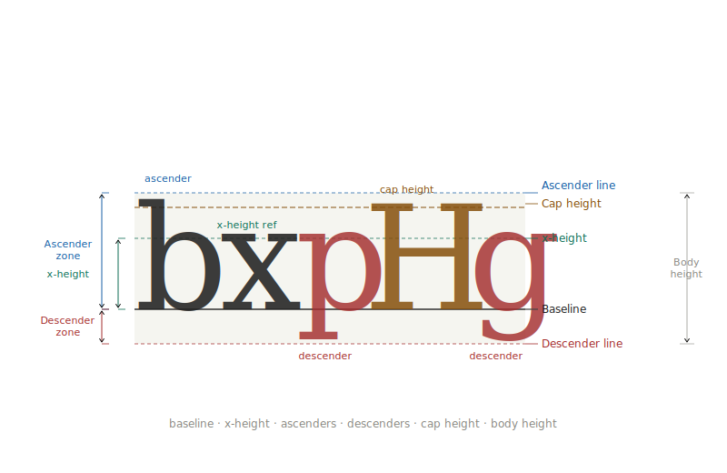
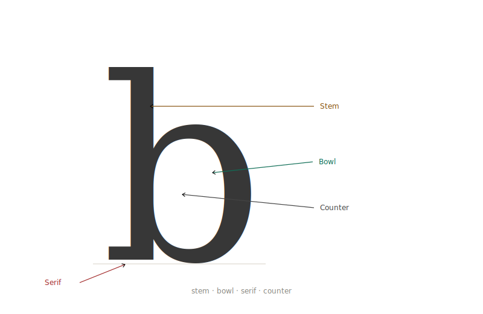
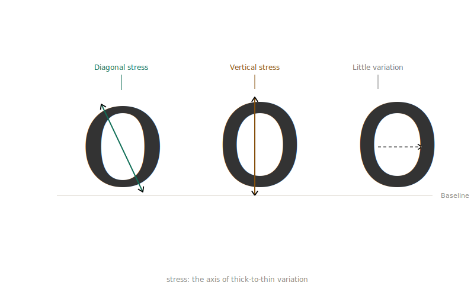
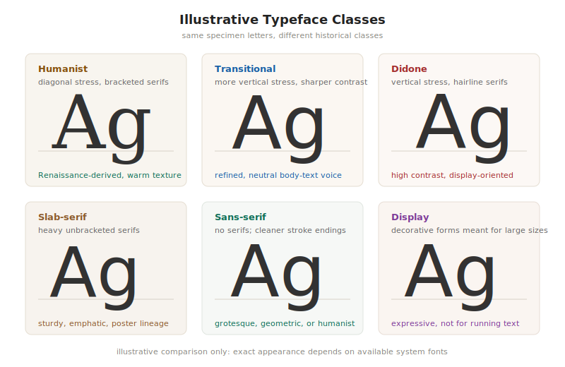
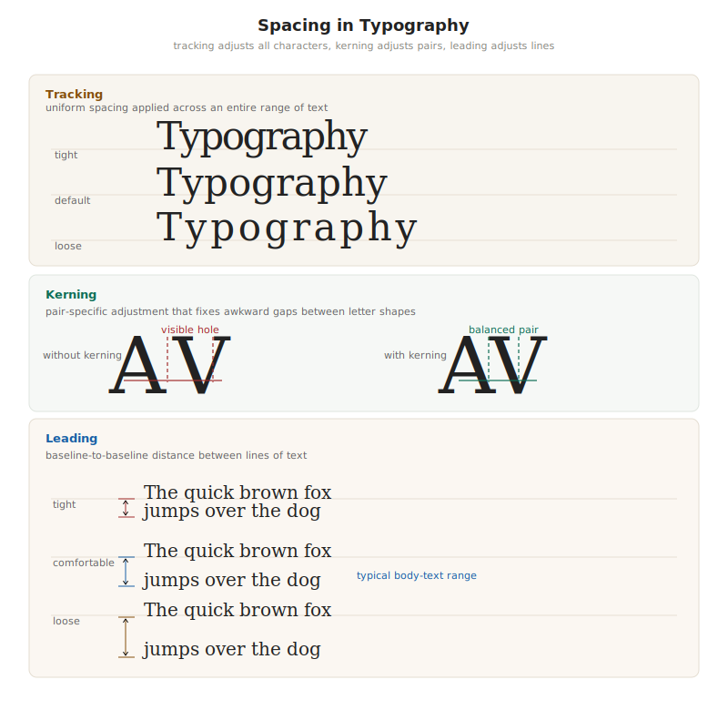

# Typography Fundamentals

Typography is older than printing. The word comes from the Greek *typos* — impression, mark — and *graphia* — writing. Long before Gutenberg cast his first piece of type, scribes were making deliberate decisions about letterforms, spacing, and the arrangement of text on a page. What printing industrialized, and what the computer later digitized, was a body of knowledge and practice that had been accumulating for centuries.

This chapter covers that body of knowledge: the anatomy of letterforms, the classification of typefaces, the mechanics of spacing, and the principles that govern how text communicates. None of it is specific to any tool. LaTeX and CSS and Typst and Quarto all expose the same underlying concepts through different syntaxes. Learning the concepts once means you will recognize them everywhere.

A note on depth: typography is a field broad enough to fill entire careers. This chapter covers what you need to work intelligently with CLI typesetting tools — enough to make good decisions, understand why certain defaults exist, and diagnose problems when the output looks wrong. For those who want to go further, the further reading appendix lists the books that practitioners actually use.

## Anatomy of a typeface

Every letter in a typeface is constructed from a set of parts that typographers have named. These names matter because they appear in technical documentation, in the specification of fonts, and in the conversations you will eventually have with designers or with yourself when something looks wrong and you need to articulate why.

The *baseline* is the invisible line on which letters sit. Most lowercase letters rest on it. Some — called *descenders* — dip below it: g, j, p, q, y. The parts that extend above the general height of lowercase letters are *ascenders*: the upward strokes of b, d, f, h, k, l, t. The height of a typical lowercase letter — specifically the flat-topped ones like x, n, a — is called the *x-height*. It is one of the most important measurements in typography because it strongly influences the apparent size and readability of a typeface. Two typefaces set at the same point size can look dramatically different in scale because their x-heights differ.

Above the x-height, ascenders reach toward the *cap height* — the top of capital letters — and sometimes beyond it. Below the baseline, descenders reach toward the *descender line*. The distance from the descender line to the cap height (or in some systems, to the top of the tallest ascender) is the overall *body height* of the type.

Individual letterforms are built from *strokes*. A stroke that ends in a tapered, wedge-shaped, or bracketed terminal is characteristic of *serif* typefaces; the serifs themselves are the small cross-strokes at the ends of the main strokes. A typeface with no such terminals is *sans-serif* — without serif. The *stem* is the primary vertical stroke of a letter. The *bowl* is a curved stroke that encloses a counter: the round space inside a b, d, o, p, or q. The *counter* itself — that enclosed space — matters enormously to readability; as type gets smaller, counters close up first, which is why typefaces intended for small sizes are designed with more open counters.

*Stress* describes the axis of thick-to-thin variation in a letterform. In Renaissance typefaces, this axis is diagonal, echoing the angle at which a broad-nib pen is held. In neoclassical typefaces, it is vertical. In slab-serif faces, there is little variation at all. Stress is a useful diagnostic: when you are trying to identify or compare typefaces, the angle of stress is one of the first things to look at.

*Optical size* is a concept that hot-metal type embodied and digital type initially abandoned. A typeface designed to be set at 8 points looks different from the same typeface designed for 72 points — the strokes are proportionally heavier, the counters more open, the letter spacing slightly wider. This is not because the type was scaled; it is because the designer drew it differently for each size, compensating for the way the eye reads at different scales. In metal, you had no choice but to do this: each size was a separate physical artifact. In early digital type, it was common to use a single master for all sizes, scaling it mathematically, which produced results that looked fine at display sizes and often looked weak or crowded in the text range. Variable fonts, introduced in 2016 as part of the OpenType specification, allow type designers to encode optical size as a continuous axis, among other variations. We will return to this in Chapter 3.

## Classifying typefaces

Type classification systems are maps, and like all maps they simplify. The most commonly used scheme, developed by Maximilien Vox in 1954 and later adopted by the British Standards Institution, divides typefaces into a handful of broad families based on their historical origins and formal characteristics. Knowing these categories will not tell you which typeface to use — that judgment requires experience and context — but it will help you understand the choices available to you and communicate about them clearly.

*Humanist* typefaces trace their lineage to the letterforms of Italian Renaissance scribes working in the 15th century. Their stress is diagonal, their serifs bracketed (meaning the transition from stroke to serif is curved rather than abrupt), and their overall texture has an organic, slightly uneven quality that recalls the hand. Garamond, Bembo, and Palatino are canonical examples. They are warm, readable at text sizes, and carry associations of scholarship and tradition. In LaTeX, Palatino is available as a standard package option; it is an excellent choice for academic documents that want to move slightly away from the default Computer Modern.

*Transitional* typefaces emerged in the 18th century, as the influence of the pen decreased and the influence of the engraver's tool increased. Stress becomes more vertical, serifs become more refined, and the contrast between thick and thin strokes increases. Times New Roman is the most widely known example, designed in 1932 for the newspaper of the same name. Baskerville is the canonical 18th-century example. Transitional typefaces are neutral in a way that humanist faces are not: they carry less character, which makes them appropriate for contexts where the typography should not call attention to itself.

*Didone* or *modern* typefaces, developed in the late 18th and early 19th centuries by Firmin Didot and Giambattista Bodoni, took the transitional direction to its extreme. Stress is fully vertical, serifs are hairline-thin with no bracketing, and the contrast between thick and thin strokes is dramatic. They are beautiful at large sizes and in well-produced print. They are difficult to read at small sizes on screen, where the hairline strokes disappear or render as a blur. Bodoni and Didot themselves are the canonical examples. Use them for display — headlines, covers, pull quotes — and rarely for body text.

*Slab-serif* typefaces replaced the hairline serifs of the Didone style with serifs of the same weight as the main strokes. They emerged in the early 19th century for advertising and display use, where legibility at distance mattered more than elegance at small size. Clarendon and Rockwell are classic examples. In the 20th century, slab serifs were rehabilitated for text use — Courier, the default monospace typeface of the typewriter era, is a slab serif — and designers like Herb Lubalin created refined slab-serif text faces. For CLI-produced documents, the slab serifs worth knowing are mostly in the monospace category, which brings us to the most practically relevant class for this book.

*Monospace* typefaces give every character the same horizontal width. A lowercase i and a capital M occupy the same amount of space. This was a constraint of the mechanical typewriter, where a fixed-width platen advance meant variable-width type was impractical. It survived into computing because early terminals could only display fixed-width character grids. Today, monospace typefaces are used primarily for code, terminal output, and anything that needs to appear as if it came from a machine. In typeset documents, they should be used sparingly and consistently — for code examples, command-line invocations, and file paths. The default monospace faces in most systems (Courier, Courier New) are functional but plain; for serious work, typefaces like Inconsolata, JetBrains Mono, or IBM Plex Mono offer considerably more refinement.

*Sans-serif* typefaces, absent the serifs entirely, first appeared in the early 19th century and were initially considered crude and utilitarian. Their rehabilitation came largely through the Bauhaus school in 1920s Germany and the Swiss typographic movement of the 1950s, which produced the International Style and typefaces like Helvetica and Univers. Sans-serif faces subdivide further: *grotesque* sans-serifs (Helvetica, Akzidenz Grotesk) have roots in the 19th century and a slight irregularity that registers as warmth; *geometric* sans-serifs (Futura, Avenir) are constructed from circles and straight lines, rational and impersonal; *humanist* sans-serifs (Gill Sans, Frutiger, Myriad) borrow their proportions from roman letterforms and tend to have the best readability at text sizes. For body text in a typeset document, humanist sans-serifs perform best among the sans categories; for headers and display, all three types have legitimate applications.

*Display* typefaces are designed for use at large sizes — above approximately 24 points — and are not suitable for body text. They include decorative faces, script faces, and extremely high-contrast or eccentric designs that become illegible when reduced.

For the practical work in this book, you will most often be working with serif faces for body text in print-oriented documents, humanist sans-serif faces for screen-oriented documents, and monospace faces for code. The document examples in Part IV will specify typefaces by name and explain the reasoning behind each choice.

## Spacing: kerning, tracking, and leading

If typeface selection is the choice of which letter shapes to use, spacing is the decision about how to arrange them relative to each other. Spacing determines whether text feels comfortable or cramped, airy or dense. It is the dimension of typography that most distinguishes professional work from amateur work, because it requires attention that software does not provide automatically.

*Tracking* (also called *letter-spacing*) is the uniform adjustment of space between all characters in a range of text. Increasing tracking opens the text up; reducing it tightens it. The appropriate amount of tracking varies with the size of the type: display-sized type (above 24 points or so) generally benefits from slightly tighter tracking than the default, because at large sizes the spaces between letters begin to read as gaps rather than intervals; body text should be set at default tracking or very slightly loose; very small text (below 9 points) benefits from slightly open tracking to improve legibility.

In LaTeX, tracking is controlled by the `microtype` package, which we will discuss in Chapter 26 under microtypography. In CSS, it is the `letter-spacing` property. In Typst, it is the `tracking` parameter. In all cases, the unit is a fraction of an em, and adjustments should be measured in small increments — the difference between good tracking and poor tracking is often less than 2% of an em.

*Kerning* is the adjustment of space between specific pairs of letters. Most fonts include kerning tables — lists of pairs that need special treatment because their shapes create awkward gaps or collisions. The classic example is the pair AV: set in a typeface with straight-sided A and V, the two letters create a visible hole between them that looks like too much space, even if the inter-character spacing is technically uniform. A kern brings them closer. Other common kerning pairs include To, Ty, We, and fa. Well-made fonts include hundreds or thousands of such pairs.

The distinction between tracking and kerning matters because they solve different problems. Tracking adjusts all spacing globally; kerning adjusts specific pairs. In practice, you should rely on the kerning built into your typeface and adjust it only rarely. What you should ensure is that kerning is turned on — some applications and pipelines disable it by default, especially in small print runs or quick previews, because it is computationally expensive. In LaTeX, kerning is enabled by default in the traditional engines and requires `microtype` for additional refinement. In CSS, font kerning can be enabled with `font-kerning: normal`.

*Leading* (pronounced *ledding*, from the lead strips of the hot-metal era) is the vertical distance from the baseline of one line to the baseline of the next. In digital typography, this concept is expressed as *line-height* in CSS and as `\baselineskip` in LaTeX. The relationship between leading and type size determines how dense or airy the text feels. A line-height of 1.0 (equal to the type size) means lines sit directly against each other with no breathing room — practically unreadable for body text. A line-height of 2.0 creates generous space but can fragment the text into islands that the eye struggles to connect. For body text in most contexts, a line-height of 1.4 to 1.6 times the type size is appropriate; wider columns benefit from slightly more leading, narrower columns from slightly less.

The relationship between type size, line length, and leading forms an interconnected system. The reader's eye needs to be able to track from the end of one line to the beginning of the next without losing its place. A long line makes this journey more difficult and requires more leading to compensate. A short line can survive with less leading. Robert Bringhurst, in *The Elements of Typographic Style* — the book that professional typographers most often cite as essential — states this as a principle: for a measure of approximately 65 characters, a leading of 1.2× to 1.4× is appropriate; for a measure of 80 to 90 characters, 1.4× to 1.6× is better.

What is the right line length? For Latin-script body text in print, the conventional wisdom — derived from reading research and long typographic practice — is 45 to 75 characters per line, with 65 as the oft-cited ideal. Shorter than 45 and the eye makes too many returns, breaking the reading rhythm; longer than 75 and the eye begins to lose its place at the line return. These are not hard limits; they are regions of comfort. Long-form reading benefits from being within them. Short-form text — captions, footnotes, tables of contents — can be set at shorter measures without harm.

In LaTeX, line length is determined by the `\textwidth` parameter, which is set by the document class and page geometry. In CSS, it is most reliably controlled with the `max-width` or `width` property on the body element or text container, and the `ch` unit (the width of the character "0" in the current font) is particularly useful: `max-width: 65ch` enforces a roughly 65-character measure regardless of font size.

## The typographic scale

Type is not set at arbitrary sizes. Professional typography uses a *type scale* — a set of related sizes that form a visual hierarchy. The sizes in a scale are not chosen at random; they stand in relationships to each other that make the difference between adjacent levels perceptible without being jarring.

The oldest type scale in continuous use is based on the sizes standardized by European printers over several centuries: 6, 7, 8, 9, 10, 11, 12, 14, 16, 18, 21, 24, 36, 48, 60, 72. These sizes appear in the default size options of LaTeX, in the presets of many desktop publishing applications, and in the suggestions of most typographic guides. They are not mathematically rigorous, but they work: the intervals between them feel proportional because they roughly approximate a geometric progression.

A more systematic approach uses the *modular scale*, popularized by Tim Brown and ultimately derived from Bringhurst: choose a base size (typically your body text size, often 10pt or 12pt) and a ratio (often the golden ratio, 1.618, or simpler ratios like 1.333 or 1.5), and generate each scale step by multiplying by the ratio. A scale based on 12pt and a ratio of 1.333 produces: 12, 16, 21.3, 28.4, 37.9, 50.5. These become your body, subheading, heading, section, display, and hero sizes.

In practice, the exact scale matters less than the consistency. A document that uses three or four sizes, applied consistently to a clear hierarchy — body text, captions, headings, title — will read more professionally than a document that uses eight sizes applied loosely. The common failure mode is proliferation: using a slightly different size for every level of heading, for captions vs. footnotes vs. callouts, until the document has no hierarchy at all but only a cloud of competing sizes.

LaTeX document classes enforce a typographic scale by defining a small set of size commands (`\tiny`, `\scriptsize`, `\footnotesize`, `\small`, `\normalsize`, `\large`, `\Large`, `\LARGE`, `\huge`, `\Huge`) as multiples of the document's base font size. This is good design. The discipline it imposes — you should have a reason to use a non-standard size, and that reason should be strong — is worth preserving even when working in systems that allow arbitrary sizes.

## Hierarchy, contrast, and the reader's eye

A typeset document is not a flat surface. It has depth — levels of importance, structure that the reader needs to navigate, signals that distinguish one kind of content from another. Typography is the visual language through which that depth is expressed. *Hierarchy* is the term for the system of visual distinctions that lets a reader see, at a glance, what a document contains and how its parts relate to each other.

Hierarchy is created through contrast. Elements at different levels of importance should look different from each other, and the difference should be perceptible immediately, without requiring the reader to parse the text to understand what they are looking at. A chapter title should look like a chapter title. A section heading should look subordinate to a chapter title. A caption should look subordinate to body text. Body text should look comfortable and neutral. Nothing should look important unless it is.

Contrast can be created through several channels: *size* (larger elements read as more important), *weight* (heavier elements — bolder type — read as more prominent), *style* (italic or small-caps type differs from roman), *color* or *value* (darker or more saturated elements command attention), *spacing* (more surrounding white space emphasizes an element), and *position* (elements at the top of a hierarchy tend to sit at the top or left of the page).

The failure mode on one side is insufficient contrast: a document where headings are only slightly larger or slightly bolder than body text, where the hierarchy exists in the markup but not on the page. The reader's eye does not know where to start; navigating the document requires effort. The failure mode on the other side is excessive contrast: too many levels, too many weights, too many sizes, a page that shouts instead of speaking. The reader's eye is pulled in too many directions at once and gives up.

Good hierarchy typically involves three to four levels at most: a title or chapter-level element, one or two levels of heading, and body text. Captions, footnotes, and marginalia form their own sub-hierarchy, consistently distinct from the main text but clearly subordinate to it. Beyond four levels, distinctions become difficult to perceive reliably and the hierarchy tends to collapse.

In LaTeX, the standard document classes provide a ready-made hierarchy of `\part`, `\chapter`, `\section`, `\subsection`, `\subsubsection`, and `\paragraph`. This is probably one level too many for most documents: the difference between a `\subsubsection` and a `\paragraph` is rarely perceptible, and documents that use all six levels are usually documents with structural problems that typography cannot solve. In CSS, you have six levels of heading (`h1` through `h6`) and the same caveat applies.

*Emphasis* is a special case of contrast — the temporary departure from the neutral appearance of body text to signal importance. Italic is the conventional form of emphasis in Latin-script text. Bold is a stronger form, appropriate for terms being defined, warnings, or labels. Both should be used sparingly: emphasis only works when it is exceptional. A paragraph with eight words in bold and five phrases in italic has no emphasis at all; it has noise.

*Small capitals* — letterforms with the shape of capitals but sized to match the x-height of lowercase — are the correct form for abbreviations (AD, BC, CEO, ISBN) set within body text. Full-size capitals in running text look too large and create interruptions in the reading rhythm. Most professional typefaces include a true small capitals variant, cut with strokes proportionally heavier than a simply scaled-down capital. LaTeX enables small capitals with `\textsc{}` when using a typeface that includes them. CSS uses `font-variant: small-caps`. If your typeface does not include true small capitals and the software fakes them by scaling regular capitals down, the result will look thin and slightly wrong — a good reason to choose typefaces that include the full range of OpenType features.

The reader's eye, moving through a well-set page, should encounter no surprises. Not visual surprises — not sudden changes in size or weight that were not part of the established hierarchy — and not cognitive surprises — not ambiguity about whether something is a heading or a caption or an emphasis or a pull quote. The job of typography is to be invisible: to make the structure of the content so clear that the reader can follow it without thinking about the medium. When typography succeeds completely, the reader remembers what they read, not how it looked.

That is, in the end, the standard. Not beauty, though good typography is often beautiful. Not complexity, though complex documents require complex typographic solutions. The standard is: does the reader get what the author intended, without friction, without confusion, and without the medium inserting itself between the content and the mind?

Everything in this book is in the service of that standard.
