# Chapter 3: Digital Typesetting Concepts

The transition from metal type to digital type was not simply a change of material. It was a change of *model*. A piece of metal type is a physical object with fixed dimensions. A digital typeface is a set of mathematical descriptions — outlines, metrics, instructions — that a rendering engine interprets to produce marks on a surface. The surface might be a screen, a laser printer, an inkjet printer, or an imagesetter producing film for a printing press. The same description serves all of them.

This abstraction is powerful and introduces its own complexities. When type existed only as metal, the relationship between the type and its output was direct: you pressed metal against paper and got an impression. In digital typography, there is a chain of interpretation between the font file and the marks on the page, and every link in that chain involves decisions — about resolution, about rendering, about color, about encoding — that affect the final result. Understanding that chain is what this chapter is about.


## Units of measurement

Typography inherited a patchwork of measurement units from centuries of print practice in different countries, and the digital era added several more. CLI typesetting tools use most of these units, and confusion between them is one of the most common sources of errors in document configuration.

The *point* is the fundamental unit of typographic measurement. Its precise value has varied historically, but the desktop publishing point — standardized by Adobe and now universal in digital systems — is exactly 1/72 of an inch, or approximately 0.353 millimeters. When you specify a font size of 12 points, you are specifying that the em square (the invisible box that contains the character, including its ascenders, descenders, and side bearings) is 12/72 of an inch tall. Note that this does not mean any particular part of the letter is 12 points tall: the relationship between the em square and the visible letterforms is determined by the type designer and varies between typefaces.

The *pica* is 12 points, or 1/6 of an inch. It is used primarily for specifying larger dimensions — column widths, margins, and spacing — in print layout. In LaTeX, picas are abbreviated as `pc`. In CSS, they are available as `pc` as well, though rarely used.

The *em* is a relative unit equal to the current font size. If you are setting 12-point type, one em is 12 points. If you change to 10-point type, one em becomes 10 points. This relativity is what makes the em useful: measurements expressed in ems scale automatically when the font size changes. In LaTeX, the em is used constantly — `\hspace{1em}`, `\setlength{\parindent}{1.5em}` — and in CSS it is one of the primary units for spacing and sizing. The *en* is half an em. Both units are used for spacing: an em dash (—) is nominally one em wide; an en dash (–) is nominally one en.

The *rem* (root em) is a CSS-specific unit equal to the font size of the root element of the document, typically the `html` element. Where the em scales with local font size, the rem is constant across the document. This makes it useful for establishing a consistent baseline grid: set a base font size on `html` and express all spacing in rems, and the proportions hold everywhere. Many modern CSS typographic systems use a combination of rems for global structure and ems for component-level spacing.

The *ex* is the x-height of the current font — the height of lowercase letters without ascenders. It is less commonly used than the em but appears in some LaTeX spacing commands and in CSS, where `1ex` scales with the optical size of the type rather than its nominal size.

Absolute units — *millimeters* (`mm`), *centimeters* (`cm`), and *inches* (`in`) — are useful for specifying page dimensions, margins, and other physical measurements in print-oriented documents. In LaTeX, page geometry is typically specified in absolute units using the `geometry` package:

```latex
\usepackage[a4paper, margin=25mm]{geometry}
```

In CSS, absolute units are meaningful only for print stylesheets (`@media print`); on screen, a CSS inch is 96 device-independent pixels, which may not correspond to a physical inch depending on the display's actual pixel density.

The *pixel* (`px` in CSS) is a screen unit with no direct equivalent in print systems. In CSS, it is a device-independent unit equal to 1/96 of a CSS inch — not necessarily one physical pixel on the display, but a unit that the browser scales appropriately for the device. Pixels are common in CSS typography but should be avoided for font sizes in favor of relative units (em or rem), because absolute pixel sizes do not respect the user's browser font size preferences, which is both an accessibility issue and, in many jurisdictions, a legal compliance concern.

The practical rule for CLI typesetting is: use points and picas for print documents in LaTeX or Typst; use ems and rems for web output in CSS; use absolute units (mm or in) for page geometry; and avoid pixels for font sizes.


## Font formats

A font file is not simply a collection of pictures of letters. It is a structured data format containing, at minimum, the outlines of the characters, the metrics that govern their spacing, and the metadata that identifies the font. Modern font formats contain considerably more than this minimum.

*TrueType* (`.ttf`) was developed jointly by Apple and Microsoft in the late 1980s as a response to Adobe's Type 1 format, which required a separate rasterizer. TrueType fonts contain character outlines described as quadratic Bézier curves and include *hinting* instructions — hand-coded or automatically generated rules that adjust the rendering of outlines at small sizes and low resolutions to improve legibility. TrueType remains widely used, particularly on Windows and in web contexts.

*OpenType* (`.otf`) was developed in the mid-1990s as a collaboration between Microsoft and Adobe and officially launched in 2000. It subsumes both TrueType and Type 1 outline formats within a single container and, more importantly, introduces an extensive set of *features* that go far beyond basic character rendering: ligatures, small capitals, old-style figures, swash characters, contextual alternates, stylistic sets, and language-specific forms. An OpenType font with a full feature set is a substantially more capable object than its predecessors. In LaTeX, OpenType features are available through XeLaTeX and LuaLaTeX (not through the original pdfLaTeX engine); in CSS, they are accessible via the `font-feature-settings` property.

*WOFF* and *WOFF2* (Web Open Font Format) are web-specific wrappers around TrueType or OpenType fonts, with compression applied. WOFF2, introduced in 2018, offers significantly better compression than WOFF and is the recommended format for web fonts today. WOFF fonts are not used in print typesetting pipelines; they are served by web servers and loaded by browsers.

*Variable fonts*, introduced as part of the OpenType specification in 2016, represent a significant departure from the traditional model of a font family as a collection of separate files — one per weight, one per width, one per style. A variable font encodes the entire design space of the family in a single file, with one or more *variation axes* (commonly weight, width, optical size, and italic) along which the design continuously varies. A variable font with a weight axis might allow you to set type at any weight from 100 to 900, not just at the discrete stops of Thin, Light, Regular, Medium, Bold, ExtraBold, and Black. In CSS, variable fonts are controlled with `font-variation-settings` and the standard properties (`font-weight`, `font-stretch`, `font-style`). In print workflows, variable font support is more limited but growing.

For CLI typesetting, the practical implications of font formats are:

- **pdfLaTeX** can only use fonts in its own internal format (Type 1 or specially prepared packages). The standard LaTeX font packages — `palatino`, `times`, `helvet`, `courier`, and many others — handle this conversion transparently. You do not work with font files directly in pdfLaTeX.
- **XeLaTeX and LuaLaTeX** can use any OpenType or TrueType font installed on your system, addressed by name. This is the path to using modern professional typefaces in LaTeX documents.
- **Typst** uses OpenType and TrueType fonts directly, addressed by file path or family name.
- **Pandoc HTML output** uses CSS font stacks and web fonts, loaded via `@font-face` or Google Fonts links in a custom template.

The choice of LaTeX engine — pdfLaTeX vs. XeLaTeX vs. LuaLaTeX — is largely a choice about font access. pdfLaTeX is faster and more portable; the other two engines open up the full range of system fonts and OpenType features. For documents that can use standard LaTeX font packages, pdfLaTeX is often the right choice. For documents that require specific professional typefaces, Unicode support beyond basic Latin, or advanced OpenType features, XeLaTeX or LuaLaTeX is necessary.


## Rasterization and hinting

A font outline is a mathematical description of a letter's shape, defined by curves and straight lines. A display or printer is a grid of discrete dots — pixels or ink droplets. The process of converting the continuous outline into marks on a discrete grid is called *rasterization*.

At large sizes, rasterization is straightforward: the grid is fine enough that the outline can be followed closely, and the result looks smooth. At small sizes, rasterization becomes difficult: the grid is coarse relative to the feature size of the letter, and small decisions about which pixels to fill can dramatically affect legibility. The stem of a lowercase letter at 8 points on a 96dpi screen might be only one or two pixels wide. Whether those pixels are filled fully or partially, and how anti-aliasing softens the edges, determines whether the type is readable.


*Hinting* is the mechanism by which type designers (or font-generation tools) encode instructions to guide the rasterizer at small sizes. Hints tell the rasterizer: snap this stem to the nearest pixel grid, align these three bowls to the same height, maintain this minimum stroke width even when the outline would suggest thinner. Good hinting is laborious to produce by hand and requires deep expertise. It is one reason that high-quality fonts from professional foundries differ from free or automatically generated fonts, particularly at screen sizes below 16px.



Modern screen rendering systems use *subpixel rendering* and *anti-aliasing* to improve apparent resolution. ClearType on Windows and CoreText on macOS both use knowledge of the physical layout of LCD subpixels (each physical pixel is composed of red, green, and blue subpixels arranged horizontally) to provide effective horizontal resolution three times higher than the pixel count would suggest. Anti-aliasing softens the stepped edges of letterforms by setting edge pixels to intermediate gray values rather than full black or full white.

For print output — laser printers at 300–600dpi, imagesetters at 1200–2400dpi — rasterization is much less of a concern. At these resolutions, outlines render cleanly at any reasonable body text size. The typographic quality of print output is determined primarily by the quality of the typeface design, the line-breaking algorithm, and the spacing decisions, not by rendering artifacts.

Understanding rasterization matters for CLI typesetting primarily in two contexts: when generating HTML output intended for screen reading, where font choice and size should be tested at actual screen resolution; and when generating PDFs intended for on-screen reading rather than print, where the same concerns apply.


## Print versus screen

The difference between print and screen typography is not merely aesthetic. It is a difference in fundamental constraints that propagates through every typographic decision.

*Resolution* is the most obvious difference. A high-quality laser printer outputs at 600 dots per inch. An offset printing press can produce halftones at 150 lines per inch with effective resolution considerably higher. A modern high-density laptop display (the Retina-class displays Apple introduced in 2012, and their equivalents from other manufacturers) renders at approximately 200–250 pixels per inch in hardware, though CSS typically treats this as 96–192 logical pixels per inch depending on the device pixel ratio. A standard desktop monitor is 96–110 pixels per inch. The gap between print and screen resolution, which was enormous in the 1980s and 1990s, has narrowed substantially but has not closed.

The practical consequence for typography is that fine details — hairline serifs, the thin strokes of Didone typefaces, the delicate optical sizing adjustments in high-quality fonts — are visible in print and may not be on screen. Type that is beautiful in a PDF may look heavy or blurry when rendered on a moderate-resolution display. This argues for testing HTML output in a browser, not just inspecting a PDF, and for choosing typefaces appropriate to the output medium.

*Color* in print is modeled in CMYK — Cyan, Magenta, Yellow, and Key (black) — the four inks used in offset printing. Color on screen is modeled in RGB — Red, Green, Blue — the three channels of light used by displays. The conversion between these color spaces is not lossless: some colors that look vivid on screen cannot be reproduced in CMYK ink, and some colors achievable in print look different on screen. For documents that contain color beyond black text — diagrams, photographs, decorative elements — awareness of the target color space is important.

For documents whose primary output is PDF intended for professional printing, color should be managed in CMYK from the start. LaTeX with the `colorspace` package and appropriate options can produce CMYK PDF output. The specific requirements for print-ready PDF — color space, resolution, fonts embedded or outlined, bleed and crop marks — are determined by the printer or print service, and we will cover the standard requirements in Chapter 8.

For documents whose primary output is HTML or screen-optimized PDF, RGB color is appropriate and CMYK is irrelevant. The concern is instead the consistency of color across different displays, which vary in color calibration, brightness, and gamut. Using standard web colors from an established palette rather than arbitrary hex values reduces the risk of colors looking significantly different on different devices.

*Bleed* is a print-specific concept. When a design element — a background color, a photograph, a colored border — is intended to run to the very edge of the printed page, it must actually extend *beyond* the intended trim edge of the page, because cutting is not perfectly precise. The standard bleed is 3mm or 1/8 inch beyond the trim edge on all sides. The document is printed on a slightly oversized sheet and then cut down; the bleed ensures that slight inaccuracies in cutting do not leave a white edge where the colored element was supposed to reach the page edge.

In LaTeX, bleed can be added with the `geometry` package by specifying a slightly larger page size and positioning the content appropriately. Most commercial printing workflows expect PDF files with bleed areas marked by crop marks. The `cropmarks` and related packages provide this in LaTeX.

For CLI-produced documents, bleed is relevant primarily for covers, promotional materials, and documents with full-bleed design elements. Standard academic papers, technical reports, and books with white backgrounds and standard margins do not require bleed.


## Unicode, encoding, and OpenType features

Until the 1990s, most computer text encoding systems were limited to a small set of characters — typically 128 or 256 — adequate for one language but not for many. ASCII, the American Standard Code for Information Interchange, encoded 128 characters: the Latin alphabet in upper and lower case, the digits, punctuation, and control characters. Extended ASCII variants added another 128 characters, enough for Western European accented characters but nothing for Greek, Cyrillic, Arabic, Chinese, Japanese, or the thousands of other scripts used in the world's writing systems.

Unicode, first published in 1991 and now in its fifteenth major version, solves this problem by assigning a unique number — a *code point* — to every character in every writing system that human beings have used, living or dead. Unicode currently encodes over 149,000 characters. Every Arabic letter, every Chinese ideograph, every mathematical symbol, every emoji, every hieroglyph is in there.

UTF-8 is the encoding form of Unicode most relevant to CLI typesetting. It represents code points as sequences of one to four bytes, with the first 128 code points (the ASCII characters) encoded as single bytes identical to ASCII. This backward compatibility means that an ASCII text file is also a valid UTF-8 file. UTF-8 is the standard encoding for HTML files, Markdown files, and most modern plain-text formats. It is the encoding you should use for all source documents. In LaTeX, you declare UTF-8 input encoding with `\usepackage[utf8]{inputenc}` when using pdfLaTeX; XeLaTeX and LuaLaTeX assume UTF-8 by default.

The practical consequences for typesetting are significant. With UTF-8 input and appropriate font support, you can include accented characters, ligatures, mathematical notation, and non-Latin scripts directly in your source document as literal characters rather than as escaped sequences or special commands. This `naïve café` is more readable in source and less error-prone than `na\"{i}ve caf\'{e}`. Whether your toolchain supports this transparently depends on the engine and font.

*Ligatures* are single glyphs that replace two or more adjacent characters whose shapes would otherwise conflict or create awkward spacing. The most common in Latin typography are fi, fl, ff, ffi, and ffl — combinations where the hook of the f would collide with the dot of the i or the ascender of the l. Quality typefaces include these standard ligatures and many more. In pdfLaTeX with the `fontenc` and `inputenc` packages configured correctly, standard ligatures are formed automatically. In XeLaTeX and LuaLaTeX, ligature behavior is controlled by OpenType feature settings.

Beyond ligatures, OpenType fonts may include a rich set of alternate character forms accessible through feature tags:

- `onum` — *old-style figures* (also called text figures): numerals with ascenders and descenders (1, 2, 3...) that sit more comfortably within lowercase text than the default *lining figures* (which are the same height as capital letters).
- `smcp` — *small capitals*: true small-capital forms for all uppercase letters.
- `sups` and `subs` — *superscript* and *subscript* forms: properly drawn raised and lowered characters, preferable to mathematically scaled versions for footnote markers, ordinals, and chemical formulas.
- `frac` — *fractions*: properly formed diagonal fractions (½, ¾) rather than the 1/2 and 3/4 that result from putting a slash between two full-size digits.
- `kern` — *kerning*: as discussed in Chapter 2, this enables the font's built-in pair-specific spacing adjustments.
- `liga` — *standard ligatures*: the basic set described above.
- `dlig` — *discretionary ligatures*: additional ligatures (ct, st, sp, and others) that are a matter of stylistic choice rather than necessity.
- `calt` — *contextual alternates*: character forms that change based on adjacent characters, common in script typefaces and some italic designs.

In LaTeX, OpenType features are accessed through the `fontspec` package (which requires XeLaTeX or LuaLaTeX):

```latex
\usepackage{fontspec}
\setmainfont{EB Garamond}[
  Numbers = OldStyle,
  Ligatures = Discretionary,
]
```

In CSS, they are accessed through `font-feature-settings`:

```css
body {
  font-family: 'EB Garamond', serif;
  font-feature-settings: "onum" 1, "liga" 1, "dlig" 1;
}
```

Not all fonts support all features. A font that claims to be an OpenType font but includes only the basic Latin character set and no features is technically compliant but practically limited. When evaluating a typeface for use in a serious document, checking the breadth of its character coverage and OpenType feature support is worthwhile. The FontForge application and the `fc-query` command-line tool can both report a font's features; we will look at these in Chapter 4.

---

The concepts in this chapter — units, formats, rendering, color models, encoding, and features — form the technical substrate of everything that follows. They are not the most glamorous aspects of typesetting, but they are the ones that bite you: the PDF with unembedded fonts that the printer refuses to accept, the HTML that ignores the user's font size preference, the LaTeX source with a smartly-quoted character that pdfLaTeX cannot process, the ligatures that disappear when you switch PDF engines. Understanding the substrate means understanding why these failures happen and how to prevent them.

The next chapter brings this technical knowledge to bear on a practical task: managing fonts from the command line.
